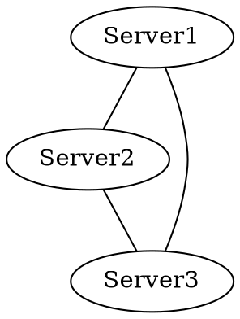
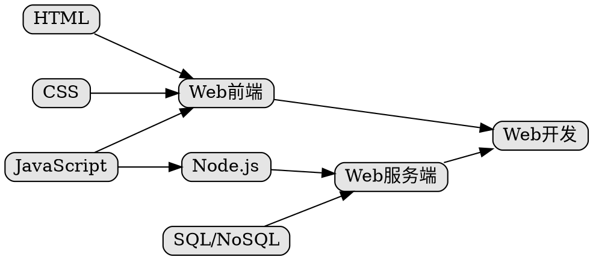

D3.js打造技能树
===

概况
---

### 背景

在开始设计新的技能树——[Sherlock](https://github.com/phodal/sherlock)的同时，结合一下原有的技能树，说说如何去设计，新的技能树还很丑。

### Showcase 

代码见： [https://github.com/phodal/sherlock](https://github.com/phodal/sherlock)


###Graphviz

>  Graphviz （英文：Graph Visualization Software的缩写）是一个由AT&T实验室启动的开源工具包，用于绘制DOT语言脚本描述的图形。它也提供了供其它软件使用的库。Graphviz是一个自由软件，其授权为Eclipse Public License。其Mac版本曾经获得2004年的苹果设计奖。

一个简单的示例代码如下:



执行编译后:

```bash
dot -Tjpg lz.dot -o lz.jpg
```

就会生成下面的图片


	
接着我们便可以建立一个简单的模型来构建我们的技能树。

步骤
---

### Step 1: 打造简单的技能树

先以JavaScript全栈作一个简单的示例，他们可能存在下面的依赖关系:


 - "JavaScript" -> "Web前端"
 - "HTML" -> "Web前端"
 - "CSS" -> "Web前端"
 - "Web前端" -> "Web开发"
 - "JavaScript" -> "Node.js" -> "Web服务端"
 - "SQL/NoSQL" -> "Web服务端"
 - "Web Server-Side" -> "Web开发"	

	
即Web前端依赖于JavaScript、HTML、CSS，而Node.js依赖于JavaScript，当然我们也需要数据的支持，大部分的网站都是数据驱动型的开发。而构成完成的开发链的则是前端 + 服务端。

于是我们有了这张图:


而我们的代码是这样的:


    
上面举出的是一个简单的例子，对应的我们可以做一些更有意思的东西，比如将dot放到Web上，详情见下一篇。

### Step 3: D3.js Tooltipster
  
使用D3.js与Darge-d3构建一个简单的技能树的时候，需要一个简单的类似于小贴士的插件。


#### Tooltipster

Tooltipster是一个jQuery tooltip 插件，兼容Mozilla Firefox, Google Chrome, IE8+。

简单示例``html``:

```html
<section class="container tooltip" title="Parent container">
	<a href="http://google.com" class="tooltip" title="Get your Google on">Google</a>
</section>
```

简单示例``js`:

```javascript
$(document).ready(function() {
	$('.tooltip').tooltipster();
});
```

D3.js、Tooltipster与Requirejs的配置如下所示:

```javascript
require.config({
  baseUrl: 'app',
  paths: {
    jquery: 'lib/jquery-2.1.3',
    d3: 'lib/d3.min',
    text: 'lib/text',
    'jquery.tooltipster': 'lib/jquery.tooltipster.min'
  },
  'shim': {
    'jquery.tooltipster': {
      deps: ['jquery']
    }
  }
});
```

#### 整合代码

最后代码如下所示:

```javascript
inner.selectAll('g.node')
  .each(function (v, id) {
    g.node(v).books = Utils.handleEmptyDocs(g.node(v).books);
    g.node(v).links = Utils.handleEmptyDocs(g.node(v).links);

    var data = {
      id: id,
      name: v,
      description: g.node(v).description,
      books: g.node(v).books,
      links: g.node(v).links
    };
    var results = lettuce.Template.tmpl(description_template, data);

    $(this).tooltipster({
      content: $(results),
      contentAsHTML: true,
      position: 'left',
      animation: 'grow',
      interactive: true});
    $(this).find('rect').css('fill', '#ecf0f1');
  });
```

