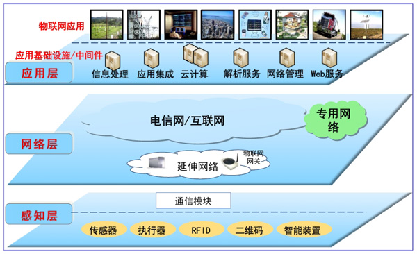
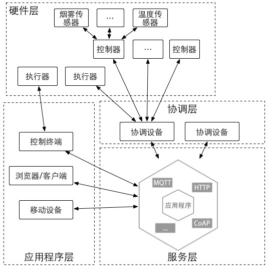
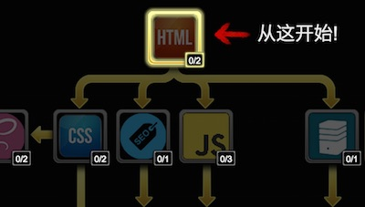

Hadoop + Pig 分析Nginx日志
======================


书籍录入程序
======


程序员专属Badge制作
===

前几天，再次看到一些CI的Badge的时候，就想着要做一个自己的Badge:


接着，我就找了个图形工具简单地先设计了下面的一个Badge:


生成的格式是SVG，接着我就打开SVG看看里面发现了什么。

```xml
<?xml version="1.0" encoding="UTF-8" standalone="no"?>
<svg width="1006px" height="150px" viewBox="0 0 1006 150" version="1.1" xmlns="http://www.w3.org/2000/svg" xmlns:xlink="http://www.w3.org/1999/xlink">
    <!-- Generator: Sketch 3.7 (28169) - http://www.bohemiancoding.com/sketch -->
    <title>phodal</title>
    <desc>Created with Sketch.</desc>
    <defs></defs>
    <g id="Page-1" stroke="none" stroke-width="1" fill="none" fill-rule="evenodd">
        <rect id="Rectangle-1" fill="#5E6772" style="mix-blend-mode: hue;" x="0" y="0" width="640" height="150"></rect>
        <rect id="Rectangle-1" fill="#2196F3" style="mix-blend-mode: hue;" x="640" y="0" width="366" height="150"></rect>
        <text id="PHODAL" font-family="Helvetica" font-size="120" font-weight="normal" fill="#FFFFFF">
            <tspan x="83" y="119">PHODAL</tspan>
        </text>
        <text id="idea" font-family="Helvetica" font-size="120" font-weight="normal" fill="#FFFFFF">
            <tspan x="704" y="122">idea</tspan>
        </text>
    </g>
</svg>
```

看了看代码很简单，我就想这可以用代码生成——我就可以生成出不同的样子了。

SVG与SVGWrite
---

SVG就是一个XML

> 可缩放矢量图形（Scalable Vector Graphics，SVG) ，是一种用来描述二维矢量图形的XML 标记语言。

要对这个XML进行修改也是一件很容易的事。只是，先找了PIL发现不支持，就找到了一个名为SVGWrite的工具。

> A Python library to create SVG drawings.

示例代码如下:

```python
import svgwrite

dwg = svgwrite.Drawing('test.svg', profile='tiny')
dwg.add(dwg.line((0, 0), (10, 0), stroke=svgwrite.rgb(10, 10, 16, '%')))
dwg.add(dwg.text('Test', insert=(0, 0.2)))
dwg.save()
```

然后我就照猫画虎地写了一个：

```python
import svgwrite

dwg = svgwrite.Drawing('idea.svg', profile='full', size=(u'1006', u'150'))

shapes = dwg.add(dwg.g(id='shapes', fill='none'))
shapes.add(dwg.rect((0, 0), (640, 150), fill='#5E6772'))
shapes.add(dwg.rect((640, 0), (366, 150), fill='#2196F3'))
shapes.add(dwg.text('PHODAL', insert=(83, 119), fill='#FFFFFF',font_size=120, font_family='Helvetica'))
shapes.add(dwg.text('idea', insert=(704, 122), fill='#FFFFFF', font_size=120, font_family='Helvetica'))

dwg.save()
```

发现和上面的样式几乎是一样的，就顺手做了剩下的几个。然后想了想，我这样做都一样，一点都不好看。

高级Badge
---

第一眼看到


我就想着要不和这个一样好了，不就是画几条线的事么。

```python

    def draw_for_bg_plus():
        for x in range(y_text_split + rect_length, width, rect_length):
            shapes.add(dwg.line((x, 0), (x, height), stroke='#EEEEEE', stroke_opacity=0.3))

        for y in range(rect_length, height, rect_length):
            shapes.add(dwg.line((y_text_split, y), (width, y), stroke='#EEEEEE', stroke_opacity=0.3))

        for x in range(y_text_split + max_rect_length, width, max_rect_length):
            for y in range(0, height, max_rect_length):
                shapes.add(dwg.line((x, y - 4), (x, y + 4), stroke='#EEEEEE', stroke_width='2', stroke_opacity=0.4))

        for y in range(0, height, max_rect_length):
            for x in range(y_text_split + max_rect_length, width, max_rect_length):
                shapes.add(dwg.line((x - 4, y), (x + 4, y), stroke='#EEEEEE', stroke_width='2', stroke_opacity=0.4))

    draw_for_bg_plus()
```

就有了下面的图，于是我又按照这种感觉来了好几下


最后代码
---

GitHub: [https://github.com/phodal/brand](https://github.com/phodal/brand)


文本编辑器
=====

JavaScript打造Slide应用
===================

又开始造一个新的轮子了，不过这次的起因比较简单，是想重新发明一个更好的博客系统(框架) —— EchoesWorks。

![EchoesWorks][1]

如名字所言，我所需要的是一个``回声``工坊，即将博客、Slide重新回放。

##需求

当前我们有不同的方式可以记录我们的想法、博客、过程，如视频、音频、博客、幻灯片等等。

然而这些并非那么完美，让我们说说这些方式的一些缺陷吧。

1. 视频。有很多技术视频从开始到结束，只有PPT，然后我们就为了这张PPT和声音下了几百M的视频。即使在今天网速很快，但是这并不代表我们可以在我们的手机上放下很多的视频。

2. 音频。音频所受到的限制我想大家都很清楚。什么也不知道~~，什么也看不到，只能听。

3. 博客。博客的主要缺点可能就是不够直接，有时会有点啰嗦。

4. 幻灯片。一个好的PPT，也就意味着上面的内容是很少的。即如果没有人说的时候，就缺少真正有用的东西。

5. 代码。我们真的需要在另外打开一个网址来看代码么?

于是，``EchoesWorks``出现了。

##EchoesWorks功能

想了想需要的功能，便将EchoesWorks需要的feature列出来:

- Slide展示(完成)
- 代码展示(github， 部分完成)
- 音频播放。将视频转为音频，然后就可以简单地配上字幕。
- 字幕。谁说字幕只能用在视频上。

blabla，这就是总的需求啦。

##现状

接着，在过去的两个星期里，完成了简单的第一个版本，即一个简单的PPT功能。

- ``Markdown`` Presentation
- Integrate Github Code/Gist Code
- ``Full Screen`` Background Image
- Left/Right Images Support
- Process Bar

###idea

1. Chrome插件。用于在一个tab里，控制另外一个tab，即类似于keynote的分屏功能。

本来想着给[EchoesWorks](https://github.com/phodal/echoesworks)做一个Chrome插件来控制Slide，后来发现了一种更简单的方法 —— 用LocalStorage实现跨tab通信。


##实现机制

在这里并没有什么特别高级的用法，只是简单的事件监听

		function handler() {
			window.slide.slide(parseInt(localStorage.getItem('echoesworks'), 10));
		}

		if (window.addEventListener) {
			window.addEventListener("storage", handler, false);
		} else {
                       // IE
			window.attachEvent("onstorage", handler);
		}

即，当监听到调用``storage``的方法，就会跳转到相应的页面。

正常情况下，我们只用一个标签来展示我们的slide。当我们有另外一个标签的时候，我们就可以存储当前的slide。

    localStorage.setItem('echoesworks', index);

这样就可以实现，在一个页面到下一页时，另外一个标签也会跳到下一页。
  

编辑-发布-分离应用
==========

​尽管没有特别的动力去构建一个全新的CMS，但是我还是愿意去撰文一篇来书写如何去做这样的事——编辑-发布-开发分离模式是如何工作的。微服务是我们对于复杂应用的一种趋势，编辑-发布-开发分离模式则是另外一种趋势。在上篇文章《[Repractise架构篇一: CMS的重构与演进](https://github.com/phodal/repractise/blob/gh-pages/chapters/refactor-cms.md)》中，我们说到编辑-发布-开发分离模式。

##系统架构

如先前提到的，Carrot使用了下面的方案来搭建他们的静态内容的CMS。


在这个方案里内容是用Contentful来发布他们的内容。而在我司[ThoughtWorks](https://www.thoughtworks.com/)的官网里则采用了Github来管理这些内容。于是如果让我们写一个基于Github的CMS，那么架构变成了这样：


或许你也用过Hexo / Jekyll / Octopress这样的静态博客，他们的原理都是类似的。我们有一个代码库用于生成静态页面，然后这些静态页面会被PUSH到Github Pages上。

从我们设计系统的角度来说，我们会在Github上有三个代码库：

1. Content。用于存放编辑器生成的JSON文件，这样我们就可以GET这些资源，并用Backbone / Angular / React 这些前端框架来搭建SPA。
2. Code。开发者在这里存放他们的代码，如主题、静态文件生成器、资源文件等等。
3. Builder。在这里它是运行于Travis CI上的一些脚本文件，用于Clone代码，并执行Code中的脚本。

以及一些额外的服务，当且仅当你有一些额外的功能需求的时候。

1. Extend Service。当我们需要搜索服务时，我们就需要这样的一些服务。如我正考虑使用Python的whoosh来完成这个功能，这时候我计划用Flask框架，但是只是计划中——因为没有合适的中间件。
2. Editor。相比于前面的那些知识这一步适合更重要，也就是为什么生成的格式是JSON而不是Markdown的原理。对于非程序员来说，要熟练掌握Markdown不是一件容易的事。于是，一个考虑中的方案就是使用 Electron + Node.js来生成API，最后通过GitHub API V3来实现上传。

So，这一个过程是如何进行的。

###用户场景

整个过程的Pipeline如下所示：

1. 编辑使用他们的编辑器来编辑的内容并点击发布，然后这个内容就可以通过GitHub API上传到Content这个Repo里。
2. 这时候需要有一个WebHooks监测到了Content代码库的变化，便运行Builder这个代码库的Travis CI。
3. 这个Builder脚本首先，会设置一些基本的git配置。然后clone Content和Code的代码，接着运行构建命令，生成新的内容。
4. 然后Builder Commit内容，并PUSH内容。

这里还依赖于WebHook这个东西——还没想到一个合适的解决方案。下面，我们对里面的内容进行一些拆解，Content里面由于是JSON就不多解释了。

##Builder: 构建工具

Github与Travis之间，可以做一个自动部署的工具。相信已经有很多人在Github上玩过这样的东西——先在Github上生成Token，然后用travis加密：

```bash
travis encrypt-file ssh_key --add
```

加密后的Key就会保存到``.travis.yml``文件里，然后就可以在Travis CI上push你的代码到Github上了。

接着，你需要创建个deploy脚本，并且在``after_success``执行它：

```yml
after_success:
  - test $TRAVIS_PULL_REQUEST == "false" && test $TRAVIS_BRANCH == "master" && bash deploy.sh
```

在这个脚本里，你所需要做的就是clone content和code中的代码，并执行code中的生成脚本，生成新的内容后，提交代码。

```
#!/bin/bash

set -o errexit -o nounset

rev=$(git rev-parse --short HEAD)

cd stage/

git init
git config user.name "Robot"
git config user.email "robot@phodal.com"

git remote add upstream "https://$GH_TOKEN@github.com/phodal-archive/echeveria-deploy.git"
git fetch upstream
git reset upstream/gh-pages

git clone https://github.com/phodal-archive/echeveria-deploy code
git clone https://github.com/phodal-archive/echeveria-content content
pwd
cp -a content/contents code/content

cd code

npm install
npm install grunt-cli -g
grunt 
mv dest/* ../
cd ../
rm -rf code
rm -rf content

touch .

if [ ! -f CNAME ]; then
    echo "deploy.baimizhou.net" > CNAME
fi

git add -A .
git commit -m "rebuild pages at ${rev}"
git push -q upstream HEAD:gh-pages
```

这就是这个builder做的事情——其中最主要的一个任务是``grunt``，它所做的就是:

```javascript
grunt.registerTask('default', ['clean', 'assemble', 'copy']);
```

##Code: 静态页面生成

Assemble是一个使用Node.js，Grunt.js，Gulp，Yeoman 等来实现的静态网页生成系统。这样的生成器有很多，Zurb Foundation, Zurb Ink, Less.js / lesscss.org, Topcoat, Web Experience Toolkit等组织都使用这个工具来生成。这个工具似乎上个Release在一年多以前，现在正在开始0.6。虽然，这并不重要，但是还是顺便一说。

我们所要做的就是在我们的``Gruntfile.js``中写相应的生成代码。

```javascript
	assemble: {
      options: {
        flatten: true,
        partials: ['templates/includes/*.hbs'],
        layoutdir: 'templates/layouts',
        data: 'content/blogs.json',
        layout: 'default.hbs'
      },
      site: {
        files: {'dest/': ['templates/*.hbs']}
      },
      blogs: {
        options: {
          flatten: true,
          layoutdir: 'templates/layouts',
          data: 'content/*.json',
          partials: ['templates/includes/*.hbs'],
          pages: pages
        },
        files: [
          { dest: './dest/blog/', src: '!*' }
        ]
      }
    }
```    

配置中的site用于生成页面相关的内容，blogs则可以根据json文件的文件名生成对就的html文件存储到blog目录中。

生成后的目录结果如下图所示：

```
 .
├── about.html
├── blog
│   ├── blog-posts.html
│   └── blogs.html
├── blog.html
├── css
│   ├── images
│   │   └── banner.jpg
│   └── style.css
├── index.html
└── js
    ├── jquery.min.js
    └── script.js

7 directories, 30 files
```

这里的静态文件内容就是最后我们要发布的内容。

还需要做的一件事情就是：

```javascript
grunt.registerTask('dev', ['default', 'connect:server', 'watch:site']);
```

用于开发阶段这样的代码就够了，这个和你使用WebPack + React 似乎相差不了多少。

##编辑-发布-开发分离

在这种情形中，编辑能否完成工作就不依赖于网站——脱稿又少了 个借口。这时候网站出错的概率太小了——你不需要一个缓存服务器、HTTP服务器，由于没有动态生成的内容，你也不需要守护进程。这些内容都是静态文件，你可以将他们放在任何可以提供静态文件托管的地方——CloudFront、S3等等。或者你再相信自己的服务器，Nginx可是全球第二好（第一还没出现）的静态文件服务器。

开发人员只在需要的时候去修改网站的一些内容。

So，你可能会担心如果这时候修改的东西有问题了怎么办。

1. 使用这种模式就意味着你需要有测试来覆盖这些构建工具、生成工具。
2. 相比于自己的代码，别人的CMS更可靠？

需要注意的是如果你上一次构建成功，你生成的文件都是正常的，那么你只需要回滚开发相关的代码即可。旧的代码仍然可以工作得很好。

其次，由于生成的是静态文件，查错的成本就比较低。

最后，重新放上之前的静态文件。

  
 > 动态网页是下一个要解决的难题。我们从数据库中读取数据，再用动态去渲染出一个静态页面，并且缓存服务器来缓存这个页面。既然我们都可以用Varnish、Squid这样的软件来缓存页面——表明它们可以是静态的，为什么不考虑直接使用静态网页呢？

为了实现之前说到的``编辑-发布-开发分离``的CMS，我还是花了两天的时间打造了一个面向普通用户的编辑器。效果截图如下所示：


作为一个普通用户，这是一个很简单的软件。除了Electron + Node.js + React作了一个140M左右的软件，尽管打包完只有40M左右 ，但是还是会把用户吓跑的。不过作为一个快速构建的原型已经很不错了——构建速度很快、并且运行良好。

尽管这个界面看上去还是稍微复杂了一下，还在试着想办法将链接名和日期去掉——问题是为什么会有这两个东西？

##从Schema到数据库

我们在我们数据库中定义好了Schema——对一个数据库的结构描述。在《[编辑-发布-开发分离](https://www.phodal.com/blog/editing-publishing-coding-seperate/)
》一文中我们说到了echeveria-content的一个数据文件如下所示：

```javascript
	{
	  "title": "白米粥",
	  "author": "白米粥",
	  "url": "baimizhou",
	  "date": "2015-10-21",
	  "description": "# Blog post \n  > This is an example blog post \n Lorem ipsum dolor sit amet, consectetur adipisicing elit, sed do eiusmod tempor incididunt ut labore et dolore magna aliqua. ",
	  "blogpost": "# Blog post \n  > This is an example blog post \n Lorem ipsum dolor sit amet, consectetur adipisicing elit, sed do eiusmod tempor incididunt ut labore et dolore magna aliqua. \n Ut enim ad minim veniam, quis nostrud exercitation ullamco laboris nisi ut aliquip ex ea commodo consequat. Duis aute irure dolor in reprehenderit in voluptate velit esse cillum dolore eu fugiat nulla pariatur. Excepteur sint occaecat cupidatat non proident, sunt in culpa qui officia deserunt mollit anim id est laborum."
	}
```

比起之前的直接生成静态页面这里的数据就是更有意思地一步了，我们从数据库读取数据就是为了生成一个JSON文件。何不直接以JSON的形式存储文件呢？

我们都定义了这每篇文章的基本元素:

1. title
2. author
3. date
4. description
5. content
6. url

即使我们使用NoSQL我们也很难逃离这种模式。我们定义这些数据，为了在使用的时候更方便。存储这些数据只是这个过程中的一部分，下部分就是取出这些数据并对他们进行过滤，取出我们需要的数据。

Web的骨架就是这么简单，当然APP也是如此。难的地方在于存储怎样的数据，返回怎样的数据。不同的网站存储着不同的数据，如淘宝存储的是商品的信息，Google存储着各种网站的数据——人们需要不同的方式去存储这些数据，为了更好地存储衍生了更多的数据存储方案——于是有了GFS、Haystack等等。运营型网站想尽办法为最后一公里努力着，成长型的网站一直在想着怎样更好的返回数据，从更好的用户体验到机器学习。而数据则是这个过程中不变的东西。

尽管，我已经想了很多办法去尽可能减少元素——在最开始的版本里只有标题和内容。然而为了满足我们在数据库中定义的结构，不得不造出来这么多对于一般用户不友好的字段。如链接名是为了存储的文件名而存在的，即这个链接名在最后会变成文件名：

```javascript
repo.write('master', 'contents/' + data.url + '.json', stringifyData, 'Robot: add article ' + data.title, options, function (err, data) {
      if(data.commit){
        that.setState({message: "上传成功" + JSON.stringify(data)});
        that.refs.snackbar.show();
        that.setState({
          sending: 0
        });
      }
    });
```    

然后，上面的数据就会变成一个对象存储到“数据库”中。

今天 ，仍然有很多人用Word、Excel来存储数据。因为对于他们来说，这些软件更为直接，他们简单地操作一下就可以对数据进行排序、筛选。数据以怎样的形式存储并不重要，重要的是他们都以文件的形式存储着。

##git作为NoSQL数据库

在控制台中运行一下 ``man git``你会得到下面的结果:


这个答案看起来很有意思——不过这看上去似乎无关主题。

不同的数据库会以不同的形式存储到文件中去。blob是git中最为基本的存储单位，我们的每个content都是一个blob。redis可以以rdb文件的形式存储到文件系统中。完成一个CMS，我们并不需要那么多的查询功能。

> 这些上千年的组织机构，只想让人们知道他们想要说的东西。

我们使用NoSQL是因为：

1. 不使用关系模型
2. 在集群中运行良好
3. 开源
4. 无模式
5. 数据交换格式

我想其中只有两点对于我来说是比较重要的``集群``与``数据格式``。但是集群和数据格式都不是我们要考虑的问题。。。

我们也不存在数据格式的问题、开源的问题，什么问题都没有。。除了，我们之前说到的查询——但是这是可以解决的问题，我们甚至可以返回不同的历史版本的。在这一点上git做得很好，他不会像WordPress那样存储多个版本。

###git + JSON文件

JSON文件 + Nginx就可以变成这样一个合理的API，甚至是运行方式。我们可以对其进行增、删、改、查，尽管就当前来说查需要一个额外的软件来执行，但是为了实现一个用得比较少的功能，而去花费大把的时间可能就是在浪费。

git的“API”提供了丰富的增、删、改功能——你需要commit就可以了。我们所要做的就是:

1. git commit
2. git push

GitHub数据分析
==========


Google Map与Solr实现多连形搜索
======================

记录一下自己做的一个小东西，当然你也可以在github上找到它:[https://github.com/phodal/gmap-solr](https://github.com/phodal/gmap-solr)

##Solr

> Solr是一个高性能，采用Java5开发，基于Lucene的全文搜索服务器。同时对其进行了扩展，提供了比Lucene更为丰富的查询语言，同时实现了可配置、可扩展并对查询性能进行了优化，并且提供了一个完善的功能管理界面，是一款非常优秀的全文搜索引擎。

简单地说: 它是一个搜索引擎

> 文档通过Http利用XML 加到一个搜索集合中。查询该集合也是通过http收到一个XML/JSON响应来实现。它的主要特性包括：高效、灵活的缓存功能，垂直搜索功能，高亮显示搜索结果，通过索引复制来提高可用性，提供一套强大Data Schema来定义字段，类型和设置文本分析，提供基于Web的管理界面等。

即schema.xml

**Solr 安装**

    brew install solr

##Gmap Solr Polygon 搜索实战

思路:

用Flask搭建一个简单的servrices，接着在前台用google的api，对后台发出请求。

###Solr Flask

由于，直接调用的是Solr的接口，所以我们的代码显得比较简单:

	class All(Resource):
	    @staticmethod
	    def get():
	        base_url = ''
	        url = (base_url + 'select?q=' + request.query_string + '+&wt=json&indent=true')
	        result = requests.get(url)
	        return (result.json()['response']['docs']), 201, {'Access-Control-Allow-Origin': '*'}


	api.add_resource(All, '/geo/')


我们在前台需要做的便是，组装geo query。

###Google map Polygon

在Google Map的API是支持Polygon搜索的，有对应的一个

    google.maps.event.addListener(drawingManager, 'polygoncomplete', renderMarker);

函数来监听，完成``polygoncomplete``时执行的函数，当我们完成搜索时，便执行``renderMarker``，在里面做的便是:

    $.get('/geo/?' + query, function (results) {
            for (var i = 0; i < results.length; i++) {
                var location = results[i].geo[0].split(',');
                var myLatLng = new google.maps.LatLng(location[0], location[1]);
                var title = results[i].title;
                marker = new google.maps.Marker({
                    position: myLatLng,
                    map: map,
                    title: title
                });

                contentString = '<h1>City</h1><br/> address ' + i + '';

                google.maps.event.addListener(marker, 'click', (function (marker, contentString, infowindow) {
                    return function () {
                        infowindow.setContent(contentString);
                        infowindow.open(map, marker);
                    };
                })(marker, contentString, infowindow));
            }
        });

对应的去解析数据，并显示在地图上
   

Growth
===

Web本身就是跨平台的，这意味着这中间存在着无限的可能性。

我是一名Web Developer，对于我来能用Web开发的事情就用Web来完成就好了——不需要编译，不需要等它编译完。我想到哪我就可以写到哪，我改到哪我就可以发生哪发生了变化。

最近我在写Growth——一个帮助开发人员成长的应用，在近一个月的业余时间里，完成了这个应用的：

 - 移动应用版：Android、Windows Phone、iOS（等账号和上线）
 - Web版
 - 桌面版：Mac OS、Windows、GNU/Linux

截图合并如下：


而更重要的是它们使用了同一份代码——除了对特定设备进行一些处理就没有其他修改。相信全栈的你已经看出来了：

Web = Chrome + Angular.js + Ionic

Desktop = Electron + Angular.js + Ionic

Mobile = Cordova + Angular.js + Ionic

除了前面的WebView不一样，后面都是Angular.js + Ionic。

##从Web到混合应用，再到桌面应用

在最打开的时候它只是一个单纯的混合应用，我想总结一下我的学习经验，分享一下学习的心得，如：

 - 完整的Web开发,运维,部署,维护介绍   
 - 如何写好代码——重构、测试、模式
 - 遗留代码、遗留系统的形成
 - 不同阶段所需的技能
 - 书籍推荐
 - 技术栈推荐
 - Web应用解决方案
 
接着我用Ionic创建了这个应用，这是一个再普通不过的过程。在这个过程里，我一直使用Chrome在调度我的代码。因为我是Android用户，我有Google Play的账号，便发布了Android版本。这时候遇到了一个问题，我并没有Apple Developer账号(现在在申请ing。。)，而主要的用户对象程序员，这是一群**不土**的土豪。


偶然间我才想到，我只要上传Web版本的代码就可以暂时性实现这个需求了。接着找了个AWS S3的插件，直接上传到了AWS S3上托管成静态文件服务。

几天前在Github上收到一个issue——关于创造桌面版， 我便想着这也是可能的，我只需要写一个启动脚本和编译脚本即可。

所以，最后我们的流程图就如下所示：


除了显示到VR设备上，好像什么也不缺了。并且在我之前的文章《[Oculus + Node.js + Three.js 打造VR世界](https://github.com/phodal/oculus-nodejs-threejs-example)》，也展示了Web在VR世界的可能性。

在这实现期间有几个点可以分享一下：

1. 响应式设计
2. 平台/设备特定代码

##响应式设计

响应式设计可以主要依赖于Media Query，而响应式设计主要要追随的一点是不同的设备不同的显示，如：


这也意味着，我们需要对不同的设备进行一些处理，如在大的屏幕下，我们需要展示菜单：


而这可以依赖于Ionic的**expose-aside-when="large"**，而并非所有的情形都是这么简单的。如我最近遇到的问题就是图片缩放的问题，之前的图片针对的都是手机版——经过了一定的缩放。

这时在桌面应用上就会出现问题，就需要限定大小等等。

而这个问题相比于平台特定问题则更容易解决。

##平台特定代码

对于特定平台才有的问题就不是一件容易解决的事，分享一下：

###存储

我遇到的第一个问题是**数据存储**的问题。最开始的时候，我只需要开始混合应用。因此我可以用**Preferences**、或者**SQLite**来存储数据。

后来，我扩展到了Web版，我只好用LocalStoarge。于是，我就开始抽象出一个**$storageServices**来做相应的事。接着遇到一系列的问题，我舍弃了原有的方案，直接使用LocalStoarge。

###数据分析

为了开发方便，我使用Google Analytics来分析用户的行为——毕竟数据对我来说也不是特别重要，只要可以看到有人使用就可以了。

这时候遇到的一个问题是，我不需要记录Web用户的行为，但是我希望可以看到有这样的请求发出。于是对于Web用户来说，只需要：

```js
        trackView: function (view) {
          console.log(view);
        }
```

而对于手机用户则是:

```js
      trackView: function (view) {
        $window.analytics.startTrackerWithId('UA-71907748-1');
        $window.analytics.trackView(view)
      }
```

这样在我调试的时候我只需要打个Log，在产品环境时就会Track。

###更新

同样的，对于Android用户来说，他们可以选择自行下载更新，所以我需要针对Android用户有一个自动更新：

```
var isAndroid = ionic.Platform.isAndroid();
if(isAndroid) {
  $updateServices.check('main');
}
```    

###桌面应用

对于桌面应用来说也会有类似的问题，我遇到的第一个问题是Electron默认开启了AMD。于是，直接删之：

```html
<script>
//remove module for electron
if(typeof module !== 'undefined' && module && module.exports){
  delete module;
}
</script>
```  

类似的问题还有许多，不过由于应用内容的限制，这些问题就没有那么严重了。

如果有一天，我有钱开放这个应用的应用号，那么我就会再次献上这个图：


##未来

我就开始思索这个问题，未来的趋势是合并到一起，而这一个趋势在现在就已经是完成时了。

那么未来呢？你觉得会是怎样的？

Ionic ElasticSearch打造O2O应用
===

搜索引擎是个好东西，GIS也是个好东西。当前还有Django和Ionic。最后效果图

 


##构架设计

对我们的需求进行简要的思考后，设计出了下面的一些简单的架构。


###GIS架构说明 —— 服务端

简单说明:

- 用户在前台或者后台创建数据。
- 在model保存数据的时候，会调用Google的API解析GPS
- 在haystack的配置中设置实时更新，当数据创建的时候自动更新索引
- 数据被ElasticSearch索引

下面是框架的一些简单的介绍

**Django**

> [Django](http://www.phodal.com/blog/tag/django/) 是一个开放源代码的Web应用框架，由Python写成。采用了MVC的软件设计模式，即模型M，视图V和控制器C。它最初是被开发来用于管理劳伦斯出版集团旗下的一些以新闻内容为主的网站的。并于2005年7月在BSD许可证下发布。这套框架是以比利时的吉普赛爵士吉他手Django Reinhardt来命名的。

> [Django](http://www.phodal.com/blog/tag/django/) 的主要目标是使得开发复杂的、数据库驱动的网站变得简单。Django注重组件的重用性和“可插拔性”，敏捷开发和DRY法则（Don't Repeat Yourself）。在Django中Python被普遍使用，甚至包括配置文件和数据模型。


首先考虑Django，而不是其他Node或者Ruby框架的原因是：

- 内置认证系统
- 内置CSRF

当然这是其他框架也所拥有的，主要特性还有:

- 一个表单序列化及验证系统，用于HTML表单和适于数据库存储的数据之间的转换。
- 一套协助创建地理信息系统（GIS）的基础框架

最后一个才是亮点，内置GIS，虽然没怎么用到，但是至少在部署上还是比较方便的。

**Haystack**

> Haystack provides modular search for Django. It features a unified, familiar API that allows you to plug in different search backends (such as Solr, Elasticsearch, Whoosh, Xapian, etc.) without having to modify your code.

Haystack是为Django提供一个搜索模块blabla..，他的主要特性是可以

>  write your search code once and choose the search engine you want it to run on

也就是说你只需要写你的代码选择你的搜索引擎就可以工作了。

**ElasticSearch**

在上面的Haystack提供了这些一堆的搜索引擎，当然支持地点搜索的只有``Solr``和``ElasticSearch``，他们支持的空间搜索有:

- within 	 
- dwithin 
- distance		 
- order_by(‘distance’) 	 
- polygon 

在文档上没有写Solr的polygon搜索，但是实际上也是支持的(详细见这篇文章: [google map solr polygon 搜索](http://www.phodal.com/blog/google-map-width-solr-use-polygon-search/，用的地图是谷歌，所以需要先学会访问谷歌)。

至于为什么用的是ElasticSearch，是因为之前用Solr做过。。。

###GIS架构说明 —— 客户端 

**简单说明  —— GET**

1. 当我们访问Map View的时候，会调用HTML5获取用户的位置
2. 根据用户的位置定位，设置缩放
3. 根据用户的位置发出ElasticSearch请求，返回结果中带上距离
4. 显示

**简单说明  —— POST**

1. 用户填写数据会发给Django API，并验证
2. 成功时，存入数据库，更新索引。

**Ionic**

> Ionic提供了一个免费且开源的移动优化HTML，CSS和JS组件库，来构建高交互性应用。基于Sass构建和AngularJS 优化。

用到的主要是AngularJS，之前用他写过三个APP。

**Django REST Framework**

与Django Tastypie相比，DRF的主要优势在于Web界面的调试。

##Django GIS准备

1.创建虚拟环境

     virtualenv -p /usr/bin/python2.67 django-elasticsearch

2.创建项目

为了方便，这里用的是Mezzanine CMS，相比Django的主要优势是，以后扩展方便。但是对于Django也是可以的。

3.安装依赖

这里我的所有依赖有

	django-haystack
	Mezzanine==3.1.10
	djangorestframework
	pygeocoder
	elasticsearch

安装

    pip install requirements.txt

4.安装ElasticSearch

CentOS

    wget https://download.elasticsearch.org/elasticsearch/elasticsearch/elasticsearch-1.4.2.zip
    sudo unzip elasticsearch-1.4.2 -d /usr/local/elasticsearch
    rm elasticsearch-1.4.2.zip
    cd /usr/local/elasticsearch/elasticsearch-1.4.2/
    ./bin/plugin install elasticsearch/elasticsearch-cloud-aws/2.4.1
    curl -XGET http://localhost:9200

Mac OS

    brew install elasticsearch

5.Django Geo环境搭建

CentOS等GNU/Linux系统: 可以参照[CentOS Django Geo 环境搭建](http://www.phodal.com/blog/install-geo-django-in-centos/)

MacOS: [Mac OS Django Geo 环境搭建](http://www.phodal.com/blog/django-elasticsearch-geo-solution/)

##配置Django 

**配置Haystack**

    HAYSTACK_SIGNAL_PROCESSOR = 'haystack.signals.RealtimeSignalProcessor'

    HAYSTACK_CONNECTIONS = {
        'default': {
            'ENGINE': 'haystack.backends.elasticsearch_backend.ElasticsearchSearchEngine',
            'URL': 'http://127.0.0.1:9200/',
            'INDEX_NAME': 'haystack',
        },
    }   

``HAYSTACK_SIGNAL_PROCESSOR``是为了可以实时处理。
``HAYSTACK_CONNECTIONS`` 则是配置搜索引擎用的。

**配置Django**

在``settings.py``中的``INSTALLED_APPS``添加

    "haystack",
    "rest_framework",


接着

     python manage.py createdb
     python manage.py migreate

运行

     python manage.py runserver


官方有一个简单的文档说明空间搜索—— [Spatial Search](http://django-haystack.readthedocs.org/en/latest/spatial.html)

里面只有``Solr``和``ElasticSearch``是支持的，当然我们也不需要这么复杂的特性。

创建Django app名为nx，目录结构如下

    .
    |______init__.py
    |____api.py
    |____models.py
    |____search_indexes.py
    |____templates
    | |____search
    | | |____indexes
    | | | |____nx
    | | | | |____note_text.txt

api.py是后面要用的。

###Django Haystack Model创建

而一般的model没有什么区别，除了修改了save方法

    from django.contrib import admin

    from django.contrib.gis.geos import Point
    from django.core import validators
    from django.utils.translation import ugettext_lazy as _
    from django.db import models
    from pygeocoder import Geocoder

    class Note(models.Model):
        title = models.CharField("标题", max_length=30, unique=True)
        latitude = models.FloatField(blank=True)
        longitude = models.FloatField(blank=True)

        def __unicode__(self):
            return self.title

        def save(self, *args, **kwargs):
            results = Geocoder.geocode(self.province + self.city + self.address)
            self.latitude = results[0].coordinates[0]
            self.longitude = results[0].coordinates[1]
            super(Note, self).save(*args, **kwargs)

        def get_location(self):
            return Point(self.longitude, self.latitude)

        def get_location_info(self):
            return self.province + self.city + self.address

    admin.site.register(Note)

通过``Geocoder.geocode`` 解析用户输入的地址，为了方便直接后台管理了。

###创建search_index

在源码的目录下有一个``search_indexes.py``的文件就是用于索引用的。

    from haystack import indexes
    from .models import Note

    class NoteIndex(indexes.SearchIndex, indexes.Indexable):
        text = indexes.CharField(document=True, use_template=True)
        title = indexes.CharField(model_attr='title')
        location = indexes.LocationField(model_attr='get_location')
        location_info = indexes.CharField(model_attr='get_location_info')

        def get_model(self):
            return Note

与些同时我们还需要在``templates/search/indexes/nx/``目录中有``note_text.txt``里面的内容是:

    {{ object.title }}
    {{ object.get_location }}
    {{ object.get_location_info }}

**创建数据**

migrate数据库

    python manage.py migrate

run

    python manage.py runserver

接着我们就可以后台创建数据了。 打开: http://127.0.0.1:8000/admin/nx/note/，把除了``Latitude``和``Longitude``以外的数据都一填——经纬度是自动生成的。就可以创建数据了。

**测试**

访问 http://localhost:9200/haystack/_search

或者

    curl -XGET http://127.0.0.1:9200/haystack/_search


如果你没有Ionic的经验，可以参考一下之前的一些文章:[《HTML5打造原生应用——Ionic框架简介与Ionic Hello World》](http://www.phodal.com/blog/ionic-development-android-ios-windows-phone-application/)。

我们用到的库有:

- elasticsearch
- ionic
- ngCordova

将他们添加到``bower.json``，然后
    bower install

吧

##Ionic ElasticSearch 创建页面

1.引入库

在``index.html``中添加

    <script src="lib/elasticsearch/elasticsearch.angular.min.js"></script>
    <script src="lib/ngCordova/dist/ng-cordova.js"></script>

接着开始写我们的搜索模板``tab-search.html``

```html
<ion-view view-title="搜索" ng-controller="SearchCtrl">
        <ion-content>
            <div id="search-bar">
                <div class="item item-input-inset">
                    <label class="item-input-wrapper" id="search-input">
                        <i class="icon ion-search placeholder-icon"></i>
                        <input type="search" placeholder="Search" ng-model="query" ng-change="search(query)" autocorrect="off">
                    </label>
                </div>
            </div>
        </ion-content>
    </ion-view>
```

显示部分

```html
<ion-list>
                <ion-item class="item-remove-animate item-icon-right" ng-repeat="result in results">
                    <h2 class="icon-left">{{result.title}}</h2>
                    <p>简介: {{result.body}}</p>
                    <div class="icon-left ion-ios-home location_info">
                        {{result.location_info}}
                    </div>
                    <div class="button icon-left ion-ios-telephone button-calm button-outline">
                        <a ng-href="tel: {{result.phone_number}}">{{result.phone_number}}</a>
                    </div>
                </ion-item>
            </ion-list>
```

而我们期待的``SearchCtrl``则是这样的

	$scope.query = "";
	var doSearch = ionic.debounce(function(query) {
		ESService.search(query, 0).then(function(results){
			$scope.results = results;
		});
	}, 500);

	$scope.search = function(query) {
		doSearch(query);
	}

当我们点下搜索的时候，调用 ESService.

##Ionic ElasticSearch Service

接着我们就来构建我们的ESService，下面的部分来自网上:

    angular.module('starter.services', ['ngCordova', 'elasticsearch'])

    .factory('ESService',
      ['$q', 'esFactory', '$location', '$localstorage', function($q, elasticsearch, $location, $localstorage){
        var client = elasticsearch({
          host: $location.host() + ":9200"
        });

        var search = function(term, offset){
          var deferred = $q.defer(), query, sort;
          if(!term){
            query = {
              "match_all": {}
            };
          } else {
            query = {
              match: { title: term }
            }
          }

          var position = $localstorage.get('position');

          if(position){
            sort = [{
              "_geo_distance": {
                "location": position,
                "unit": "km"
              }
            }];
          } else {
            sort = [];
          }

          client.search({
            "index": 'haystack',
            "body": {
              "query": query,
              "sort": sort
            }
          }).then(function(result) {
            var ii = 0, hits_in, hits_out = [];
            hits_in = (result.hits || {}).hits || [];
            for(;ii < hits_in.length; ii++){
              var data = hits_in[ii]._source;
              var distance = {};
              if(hits_in[ii].sort){
                distance = {"distance": parseFloat(hits_in[ii].sort[0]).toFixed(1)}
              }
              angular.extend(data, distance);
              hits_out.push(data);
            }
            deferred.resolve(hits_out);
          }, deferred.reject);

          return deferred.promise;
        };


        return {
          "search": search
        };
      }]
    );

这个Service主要做的是创建ElasitcSearch Query，然后返回解析结果。


**设计思路**

1. 判断是否有上次记录的位置信息，如果有则将地图的中心设置为上次的位置。

2. 将位置添加到ElasticSearch的Query中。

3. 从ElasticSearch中获取数据，并解析Render到地图上。


**OpenLayer**

> OpenLayers是一个用于开发WebGIS客户端的JavaScript包。OpenLayers 支持的地图来源包括Google Maps、Yahoo、 Map、微软Virtual Earth 等，用户还可以用简单的图片地图作为背景图，与其他的图层在OpenLayers 中进行叠加，在这一方面OpenLayers提供了非常多的选择。除此之外，OpenLayers实现访问地理空间数据的方法都符合行业标准。OpenLayers 支持Open GIS 协会制定的WMS（Web Mapping Service）和WFS（Web Feature Service）等网络服务规范，可以通过远程服务的方式，将以OGC 服务形式发布的地图数据加载到基于浏览器的OpenLayers 客户端中进行显示。OpenLayers采用面向对象方式开发，并使用来自Prototype.js和Rico中的一些组件。

###添加OpenLayer 3

1.下载OpenLayer

2.添加到``index.html``:

    <script src="js/ol.js"></script>

## Ionic OpenLayer 地图显示

**创建NSService**

新建一个``MapCtrl``，需要用到``ESService``和 ``NSService``，NSService是官方示例中的一个函数，提供了一个``getRendererFromQueryString``方法。

    .factory('NSService', function(){
          var exampleNS = {};

          exampleNS.getRendererFromQueryString = function() {
            var obj = {}, queryString = location.search.slice(1),
                re = /([^&=]+)=([^&]*)/g, m;

            while (m = re.exec(queryString)) {
              obj[decodeURIComponent(m[1])] = decodeURIComponent(m[2]);
            }
            if ('renderers' in obj) {
              return obj['renderers'].split(',');
            } else if ('renderer' in obj) {
              return [obj['renderer']];
            } else {
              return undefined;
            }
          };

          return {
            "exampleNS": exampleNS
          };
    })

**创建基本地图显示**

这里我们使用的是Bing地图:

      var view = new ol.View({
		center: map_center,
		zoom: 4
	});

	var controls = ol.control.defaults({rotate: false});
	var interactions = ol.interaction.defaults({altShiftDragRotate:false, pinchRotate:false});

	var map = new ol.Map({
		controls: controls,
		interactions: interactions,
		layers: [
			new ol.layer.Tile({
				source: new ol.source.BingMaps({
					key: 'Ak-dzM4wZjSqTlzveKz5u0d4IQ4bRzVI309GxmkgSVr1ewS6iPSrOvOKhA-CJlm3',
					culture: 'zh-CN',
					imagerySet: 'Road'
				})
			})
		],
		renderer: NSService.exampleNS.getRendererFromQueryString(),
		target: 'map',
		view: view
	});

一个简单的地图如上如示。

**获取当前位置**

ngCordova有一个插件是``$cordovaGeolocation``，用于获取当前的位置。代码如下所示:

	var posOptions = {timeout: 10000, enableHighAccuracy: true};
	$cordovaGeolocation
		.getCurrentPosition(posOptions)
		.then(function (position) {
			var pos = new ol.proj.transform([position.coords.longitude, position.coords.latitude], 'EPSG:4326', 'EPSG:3857');

			$localstorage.set('position', [position.coords.latitude, position.coords.longitude].toString());
			$localstorage.set('map_center', pos);

			view.setCenter(pos);
		}, function (err) {
			console.log(err)
		});


当获取到位置时，将位置存储到``localstorage``中。

**获取结果并显示**

最后代码如下所示，获取解析后的结果，添加icon

	ESService.search("", 0).then(function(results){
		var vectorSource = new ol.source.Vector({ });
		$.each(results, function(index, result){
			var position = result.location.split(",");
			var pos = ol.proj.transform([parseFloat(position[1]), parseFloat(position[0])], 'EPSG:4326', 'EPSG:3857');

			var iconFeature = new ol.Feature({
					geometry: new ol.geom.Point(pos),
					name: result.title,
					phone: result.phone_number,
					distance: result.distance
			});
			vectorSource.addFeature(iconFeature);
		});

		var iconStyle = new ol.style.Style({
			image: new ol.style.Icon(({
				anchor: [0.5, 46],
				anchorXUnits: 'fraction',
				anchorYUnits: 'pixels',
				opacity: 0.75,
				src: 'img/icon.png'
			}))
		});

		var vectorLayer = new ol.layer.Vector({
			source: vectorSource,
			style: iconStyle
		});
		map.addLayer(vectorLayer);
	});

**添加点击事件**

在上面的代码中添加:

		var element = document.getElementById('popup');

		var popup = new ol.Overlay({
			element: element,
			positioning: 'bottom-center',
			stopEvent: false
		});
		map.addOverlay(popup);

		map.on('click', function(evt) {
			var feature = map.forEachFeatureAtPixel(evt.pixel,
				function(feature, layer) {
					return feature;
				});

			if (feature) {
				var geometry = feature.getGeometry();
				var coord = geometry.getCoordinates();
				popup.setPosition(coord);
				$(element).popover({
					'placement': 'top',
					'html': true,
					'content': "<h4>商品:" + feature.get('name') + "</h4>" + '' +
					'<div class="button icon-left ion-ios-telephone button-calm button-outline">' +
					'<a ng-href="tel: {{result.phone_number}}">' + feature.get('phone') + '</a> </div>' +
						"<p class='icon-left ion-ios-navigate'> " + feature.get('distance') + "公里</p>"
				});
				$(element).popover('show');
			} else {
				$(element).popover('destroy');
			}
		});

当用户点击时，调用Bootstrap的Popover来显示信息。


    

跨协议的物联网平台设计
===

在设计 lan (Github: [https://github.com/phodal/lan](https://github.com/phodal/lan)) 物联网平台的时候，结合之前的一些经验，构建出一个实际应用中的物联网构架模型。

然后像[lan](https://github.com/phodal/lan)这样的应用，在里面刚属于服务层。

##物联网层级结构

通常，我们很容易在网上看到如下图所示的三层结构:



从理论上划分这样的层级结构是没有问题的，也是有各种理论依据。然而理论和现实往往是严重脱轨的，如上图所示，图中将网络层单独分为了一层，而并没有独立出应用程序相关的功能。

从实践的角度上，我更愿意用如下的架构来构建我的物联网系统。



其功能可以用下表来表示。

层级|作用|与下一层级的连接方式 
---|----------|------------------
硬件层|获取、发送传感器数据，执行指令|串口、蓝牙、有线、SPI、WiFi、USB等等
协调层|协调硬件层与服务器的通信，并负责处理部分数据|网络连接及硬件层的连接方式
服务层|以视为服务器层|网络连接
应用程序层|为用户提供交互功能|网络连接

硬件层包含了数据众多的传感器、控制器、以及执行器，通常这部份会由硬件人员与硬件开发人员一起协作和开发。而协调层则是充当硬件与服务层通信的桥梁，这是在系统中需要**特别考虑**的部份，一个物联网系统的设计主要**取决于这个层级**。

##物联网服务层

而服务层的核心是传统的Web应用程序的结构，只是协议层变成了一些适配器，我们需要支持不同的协议，这导致了我们在这个层需要有一个更好的结构，故而我们建议使用**六边形架构**。而在实际中，用户最后接触到的便是应用程序层，在这一层中需要有很好的用户体验设计及流畅度。

因而在设计[Lan](https://github.com/phodal/lan)物联网平台的时候，参考了之前的[物联网平台](https://github.com/phodal/diaonan)的设计，增加了用户授权以及模块化加载思想。


上图的模型可以让我们脱离具体的框架与实现，关注于业务上逻辑。
  
  

一步步搭建JavaScript框架: Lettuce
==========================

从开始打算写一个MV*，到一个简单的demo，花了几天的时间，虽然很多代码都是复制/改造过来的，然而**It Works**(nginx的那句话会让人激动有木有)。现在他叫lettuce，代码 [https://github.com/phodal/lettuce](https://github.com/phodal/lettuce)，如果有兴趣可以加入我们。

虽然js还不够expert，但是开始了。

##JavaScript项目名称

一开始我做的3次commits是:

    * e4e6e04 - Add README.md (3 weeks ago) <Fengda HUANG>
    * 37411d7 - publish bower (3 weeks ago) <Fengda HUANG>
    * aabf278 - init project (3 weeks ago) <Fengda HUANG>

是的一开始什么也没做，除了从``bower``和``npm``上注册了一个叫做``lettuce``的库:

    {
      "name": "lettuce",
      "version": "0.0.2",
      "authors": [
        "Fengda HUANG <h@phodal.com>"
      ],
      "description": "A Mobile JavaScript Framework",
      "main": "index.js",
      "moduleType": [
        "amd",
        "node"
      ],
      "keywords": [
        "lettuce",
        "mobile"
      ],
      "license": "MIT",
      "homepage": "http://lettuce.phodal.com",
      "private": false,
      "ignore": [
        "**/.*",
        "node_modules",
        "bower_components",
        "test",
        "tests"
      ]
    }


然后在我们还没有开始写代码的时候版本就已经是``0.0.2``这个速度好快。。总结如下:

 - 取一个好的名字
 - 在npm和bower上挖一个坑给自己
 - 开始写README.md

所以我的``README.md``是这样子的

    #Lettuce

    > A is Mobile JavaScript Framework

    Coming soon

是的，我们的代码已经``Coming soon``了。

##生成Javascript项目框架

为了简化这一个痛苦的过程，我们还是用yeoman。

###安装Yeoman lib生成器

1.安装yeoman

    npm install -g yo

2.安装generator-lib

     npm install -g generator-lib

3.创建项目
 
     mkdir ~/lettuce && cd $_
     yo lib

接着我们就迎来了

         _-----_
        |       |
        |--(o)--|   .--------------------------.
       `---------´  |    Welcome to Yeoman,    |
        ( _´U`_ )   |   ladies and gentlemen!  |
        /___A___\   '__________________________'
         |  ~  |
       __'.___.'__
     ´   `  |° ´ Y `

    [?] What do you want to call your lib? Lettuce
    [?] Describe your lib: A Framework for Romantic
    [?] What is your GitHub username? phodal
    [?] What is your full name? Fengda Huang
    [?] What year for the copyright? 2015


省略上百字，你的目录里就会有

    .
    |____.editorconfig
    |____.gitattributes
    |____.gitignore
    |____.jshintrc
    |____bower.json
    |____demo
    | |____assets
    | | |____main.css
    | | |____normalize.css
    | |____index.html
    |____dist
    | |____Lettuce.js
    | |____Lettuce.min.js
    |____docs
    | |____MAIN.md
    |____Gruntfile.js
    |____index.html
    |____LICENSE.txt
    |____package.json
    |____README.md
    |____src
    | |_____intro.js
    | |_____outro.js
    | |____main.js
    |____test
    | |____all.html
    | |____all.js
    | |____lib
    | | |____qunit.css
    | | |____qunit.js

这么多的文件。

##Build JavaScript项目

于是我们执行了一下

    grunt

就有了这么多的log:

    Running "concat:dist" (concat) task
    File "dist/Lettuce.js" created.

    Running "jshint:files" (jshint) task
    >> 1 file lint free.

    Running "qunit:files" (qunit) task
    Testing test/all.html .OK
    >> 1 assertions passed (20ms)

    Running "uglify:dist" (uglify) task
    File "dist/Lettuce.min.js" created.

    Done, without errors.

看看我们的Lettuce.js里面有什么

    (function(root, undefined) {
      "use strict";
    /* Lettuce main */
    // Base function.
    var Lettuce = function() {
      // Add functionality here.
      return true;
    };
    // Version.
    Lettuce.VERSION = '0.0.1';
    // Export to the root, which is probably `window`.
    root.Lettuce = Lettuce;
    }(this));

我们的库写在[立即执行函数表达式](https://www.phodal.com/blog/javascript-immediately-invoked-function-expression)里面。这样便是和jQuery等库一样了。

grunt里的任务包含了:

 - jshint 代码检查
 - contact 合并js到一个文件
 - minify js 压缩js
 - qunit 单元测试

这样我们就可以轻松上路了。

基于Virtual DOM的测试代码生成
===

> 尽管是在年末，并且也还没把书翻译完，也还没写完书的第一稿。但是，我还是觉得这是一个非常不错的话题——测试代码生成。

当我们在写一些UI测试的时候，我们总需要到浏览器去看一下一些DOM的变化。比如，我们点击了某个下拉菜单，会有另外一个联动的下拉菜单发生了变化。而如果这个事件更复杂的时候，有时我们可能就很难观察出来他们之间的变化。

##Virtual DOM

尽管这里的例子是以Jasmine作为例子，但是我想对于React也会有同样的方法。

###一个Jasmine jQuery测试

如下是一个简单的Jamine jQuery的测试示例：

```javascript
  describe("toHaveCss", function (){
    beforeEach(function (){
      setFixtures(sandbox())
    })

    it("should pass if the element has matching css", function (){
      $("#sandbox").css("display", "none")
      $("#sandbox").css("margin-left", "10px")
      expect($("#sandbox")).toHaveCss({display: "none", "margin-left": "10px"})
    })
});
```

在beforeEach的时候，我们设定了固定的DOM进去，按照用户的行为做一些相应的操作。接着依据这个DOM中的元素变化 ，来作一些断言。

那么，即使我们已经有一个固定的DOM，想要监听这个DOM的变化就是一件容易的事。在我们断言之前，我们就会有一个新的DOM。我们只需要Diff一下这两个DOM的变化，就可以生成这部分测试代码。

###virtual-dom与HyperScript

在寻觅中发现了[virtual-dom](https://github.com/Matt-Esch/virtual-dom)这个库，一个可以支持创建元素、diff计算以及patch操作的库，并且它效率好像还不错。

virtual-dom可以说由下面几部分组成的：

1. createElement，用于创建virtual Node。
2. diff，顾名思义，diff算法。
3. h，用于创建虚拟树的DSL——HyperScript。HyperScript是一个JavaScript的HyperText。
4. patch，用于patch修改的内容。

举例来说，我们有下面一个生成Virtual DOM的函数:

```javascript
function render(count)  {
    return h('div', {
        style: {
            textAlign: 'center',
            lineHeight: (100 + count) + 'px',
            border: '1px solid red',
            width: (100 + count) + 'px',
            height: (100 + count) + 'px'
        }
    }, [String(count)]);
}
```
 
render函数用于生成一个Virtual Node。在这里，我们可以将我们的变量传进去，如1。就会生成如下图所示的节点：

```javascript
{
    "children": [
        {
            "text": "1"
        }
    ],
    "count": 1,
    "descendantHooks": false,
    "hasThunks": false,
    "hasWidgets": false,
    "namespace": null,
    "properties": {
        "style": {
            "border": "1px solid red",
            "height": "101px",
            "lineHeight": "101px",
            "textAlign": "center",
            "width": "101px"
        }
    },
    "tagName": "DIV"
}
```

其中包含中相对应的属性等等。而我们只要调用createElement就可以创建出这个DOM。

如果我们修改了这个节点的一些元素，或者我们render了一个count=2的值时，我们就可以diff两个DOM。如:

```javascript
virtualDom.diff(render(2), render(1))
```

根据两个值的变化就会生成如下的一个对象：

```javascript
{
    "0": {
        "patch": {
            "style": {
                "height": "101px",
                "lineHeight": "101px",
                "width": "101px"
            }
        },
        "type": 4,
        "vNode": {
            ...
        }
    },
    "1": {
        "patch": {
            "text": "1"
        },
        "type": 1,
        "vNode": {
            "text": "2"
        }
    },
    ...
}
```

第一个对象，即0中包含了一些属性的变化。而第二个则是文本的变化——从2变成了1。我们所要做的测试生成便是标记这些变化，并记录之。

##标记DOM变化

由于virtual-dom依赖于虚拟节点vNode，我们需要将fixtures转换为hyperscript。这里我们就需要一个名为html2hyperscript的插件，来解析html。接着，我们就可以diff转换完后的DOM：

```javascript
var leftNode = "", rightNode = "";
var fixtures = '<div id="example"><h1 class="hello">Hello World</h1></div>';
var change = '<div id="example"><h1 class="hello">Hello World</h1><h2>fs</h2></div>';
parser(fixtures, function (err, hscript) {
  leftNode = eval(hscript);
});

parser(change, function (err, hscript) {
  rightNode = eval(hscript);
});

var patches = diff(leftNode, rightNode);
```    

接着，我们需要调用patch函数来做一些相应的改变。

```javascript
luffa.patch(virtualDom.create(leftNode), patches)
```

并且，我们可以尝试在patch阶段做一些处理——输出修改：

```javascript
function printChange(originRootNodeHTML, applyNode) {
  var patchType;

  for (var patchIndex = 0; patchIndex < applyNode.newNodes.length; patchIndex++) {
    patchType = applyNode.newNodes[patchIndex].method;
    switch (patchType) {
      case 'insert':
        printInsert(applyNode);
        break;
      case 'node':
        printNode(applyNode, originRootNodeHTML, patchIndex);
        break;
      case 'remove':
        printRemove(applyNode, originRootNodeHTML, patchIndex);
        break;
      case 'string':
        printString(applyNode, originRootNodeHTML, patchIndex);
        break;
      case 'prop':
        printProp(applyNode, originRootNodeHTML, patchIndex);
        break;
      default:
        printDefault(applyNode, originRootNodeHTML, patchIndex);
    }
  }
}
```

根据不同的类型，作一些对应的输出处理，如pringNode：

```javascript
function printNode(applyNode, originRootNodeHTML, patchIndex) {
  var originNode = $(applyNode.newNodes[patchIndex].vNode).prop('outerHTML') || $(applyNode.newNodes[patchIndex].vNode).text();
  var newNode = $(applyNode.newNodes[patchIndex].newNode).prop('outerHTML');

  console.log('%c' + originRootNodeHTML.replace(originNode, '%c' + originNode + '%c') + ', %c' + newNode, luffa.ORIGIN_STYLE, luffa.CHANGE_STYLE, luffa.ORIGIN_STYLE, luffa.NEW_STYLE);
}
```

用Chrome的console来标记修改的部分，及添加的部分。

最后，我们似乎就可以生成相应的测试代码了。。。

###其他

源码见：[https://github.com/phodal/luffa](https://github.com/phodal/luffa)

移动框架
===

看到项目上的移动框架，网上寻找了一下，发现原来这些一开始都有。于是，找了个示例开始构建一个移动平台的CMS——[墨颀 CMS](http://cms.moqi.mobi)，方便项目深入理解的同时，也可以自己维护一个CMS系统。

##构建框架

尝试过用AngularJS和EmberJS，发现对于使用AngluarJS以及EmberJS来说，主要的问题是要使用自己熟悉的东西没那么容易引入。而且考虑到谷歌向来对自己的项目的支持不是很好~~，所以便放弃了AngluarJS的想法。

于是开始寻找一些方案，但是最后还是选择了一个比较通用的方案。

 - RequireJS
 - jQuery
 - Underscore
 - Backbone

相对于AngularJS来说，Backbone是一个轻量级的方案，从大小上来说。对于自己来说，灵活性算是其中好的一点，也就是自己可以随意的加入很多东西。

**关于Backbone**

> Backbone.js是一套JavaScript框架与RESTful JSON的应用程式接口。也是一套大致上符合MVC架构的编程范型。Backbone.js以轻量为特色，只需依赖一套Javascript 函式库即可运行。

具体功能上应该是

 - Backbone 轻量级，支持jquery，自带路由，对象化视图，强大的sync机制减少页面大小从而加快页面显示。
 - jQuery jQuery使用户能更方便地处理HTML（标准通用标记语言下的一个应用）、events、实现动画效果，并且方便地为网站提供AJAX交互。不过主要是jQuery能够使用户的html页面保持代码和html内容分离，只需定义id即可。
 - Underscore是Backbone的依赖库  Underscore 是一个JavaScript实用库,提供了类似Prototype.js的一些功能,但是没有继承任何JavaScript内置对象。
  - RequireJS 你可以顺序读取仅需要相关依赖模块。

前台UI，使用的是Pure CSS，一个轻量级的CSS框架，但是最后感觉，总体用到一起，大小还是相当的。只是可以有一个更好的移动体验。

****其他可替换的框架**

**AngularJS**，考虑到某些因素，可能会替换掉Backbone，但是还不是当前可行的方案。为了学习是一方案，也为了更好的普及某些东西。

**handlebars**  Handlebars 是Mustache的改进，显示与逻辑分离，语法兼容Mustache，可以编译成代码，改进Mustache对路径的支持，但是若需要在服务端运行需要使用服务端Javascript引擎如Node.js。

**项目**

前后端分离设计，后台对前台只提供JSON数据，所以在某种意义上来说可能会只适合浏览，和这个要配合后台的框架。总的来说，适合于阅读类的网站。

**源码**

代码依然是放在Github上，基本功能已经可以Works了。

[https://github.com/gmszone/moqi.mobi](https://github.com/gmszone/moqi.mobi)

**进展及目的**

最后目标:构建一个移动平台的CMS系统。

当前:对于这样一个项目来说，目前会考虑优先支持下面的两个框架，

 - Django+Tastypie API
 - Wordpress

现在：可以从后台读取到数据。

**其他**

一些比较好的资料有

- [Organizing your application using Modules](http://backbonetutorials.com/organizing-backbone-using-modules/)
 - [Converting an existing Backbone.js project to Require.js](http://ozkatz.github.io/converting-an-existing-backbonejs-project-to-requirejs.html)


在一篇[构建基于Javascript的移动web CMS入门——简介](http://www.phodal.com/blog/use-jquery-backbone-mustache-build-mobile-app-cms/)中简单的介绍了关于[墨颀CMS](http://cms.moqi.mobi)的一些原理，其极框架组成，于是开始接着应该说明一下这个CMS是如何一步步搭建起来。

##RequireJS 使用

**库及依赖**

这里用的是bower的JS来下载库，详细可以参考一下[bower install js使用bower管理js](http://www.phodal.com/blog/use-bower-to-install-js-plugins/) 这篇文章。

需要下载的库有

 -  RequireJS
 - Backbone
 - Underscore
 - Mustache
 - jQuery

###使用RequireJS

引用官网的示例

	<!DOCTYPE html>
	<html>
	    <head>
	        <title>My Sample Project</title>
	        <!-- data-main attribute tells require.js to load
	             scripts/main.js after require.js loads. -->
	        <script data-main="js/main" src="lib/require.js"></script>
	    </head>
	    <body>
	        <h1>My Sample Project</h1>
	    </body>
	</html>

我们需要一个require.js和一个main.js放在同一个目录，在main.js中用使用require()来载入需要加载的脚本。

	require.config({
	    baseUrl: 'lib/',
	    paths: {
	        jquery: 'jquery-2.1.1.min'
	    },
	    shim: {
	        underscore: {
	            exports: '_'
	        }
	    }
	});

	require(['../app'], function(App){
	    App.initialize();
	});

在config中可以配置好其他的库，接着调用了app.js。

	define(['jquery', 'underscore'], function($, _){
	    var initialize = function() {
	        console.log("Hello World");
	    }

	    return {
	        initialize: initialize
	    };
	});

当打开index.html的时候便会在console中输出``Hello World``。这样我们就完成一个基本的框架，只是还没有HTML，这个将会在下次继续。

在上一篇[《构建基于Javascript的移动CMS——Hello,World》](www.phodal.com/blog/use-jquery-backbone-mustache-build-mobile-app-cms/)讲述了[墨颀 CMS](http://cms.moqi.mobi/)的大概组成，并进行了一个简单的示例，即Hello,World。这一次，我们将把CMS简单的放到一个可以运行的服务器环境中，也就是说我们需要一个简单的运行环境，以便于进行更有意思的东西——添加模板。


###环境准备

**类Unix系统**

因为电脑上已经装有python了，这里便用python起一个简单的server，对于GNU/Linux、Mac OS等类unix系统来说，都可以这样运行:

    python -m SimpleHTTPServer 8000
   
**Windows**
    
对于Windows来说，如果你已经装有python的话，那自然是可以用上面的方式运行。如果没有的话，可以试一下``mongoose``，下载一个安装之。

**JS库准备**

需要准备的JS库有

 - Backbone
 - RequireJs的插件text.js
 - Mustache

那么就这样子吧

     git@github.com:gmszone/moqi.mobi.git
     
接着切换到learing分支

     git checkout learning     
     
checkout到这个版本

    git checkout 62fbdaf

文件列表如下所示

	.
	|____app.js
	|____backbone.js
	|____HomeView.js
	|____index.html
	|____jquery.js
	|____main.js
	|____mustache.js
	|____require.js
	|____router.js
	|____text.js
	|____underscore.js
	
在这里有些混乱，但是为了少去其中的一些配置的麻烦，就先这样讲述。

###添加路由

用Backbone的一个目的就在于其的路由功能，于是便添加这样一个js——``router.js``,内容如下所示:

    define([
        'jquery',
        'underscore',
        'backbone',
        'HomeView.js'
    ], function($, _, Backbone, HomeView) {

        var AppRouter = Backbone.Router.extend({
            routes: {
                'index': 'homePage',
                '*actions': 'homePage'
            }
        });
        var initialize = function() {
            var app_router = new AppRouter;

            app_router.on('route:homePage', function() {
                var homeView = new HomeView();
                homeView.render();
            });

            Backbone.history.start();
        };
        return {
            initialize: initialize
        };
    });
    
在这里我们先忽略掉HomeView.js，因为这是下面要讲的，在router.js中，我们定义了一个AppRouter，

 - ``index``指向的是在初始化时候定义的homePage，这样就可以将主页转向HomeView.js。
 - ``*actions``便是将其他未匹配的都转向homePage。
 
接着我们需要修改一下``app.js``，让他一运行地时候便可以进入路由选择

	define(['jquery', 'underscore', 'router'], function($, _, Router) {
	    var initialize = function() {
	        Router.initialize();
	    };

	    return {
	        initialize: initialize
	    };
	});
	
也就是初始化一下路由。

###创建主页View

使用Mustache的优点在于，后台仅仅只需要提供数据，并在前台提供一个位置。因此我们修改了下HTML

	<!DOCTYPE html>
	<html>
	    <head>
	        <title>My Sample Project</title>
	        <script data-main="main" src="require.js"></script>
	    </head>
	    <body>
	    	<div id="aboutArea">{{project}}</div>
	    </body>
	</html
	
创建了aboutArea这样一个ID，于是我们便可以很愉快地在HomeView.js中添加project的数据。	

	define([
	    'jquery',
	    'underscore',
	    'mustache',
	    'text!/index.html'
	], function($, _, Mustache, indexTemplate) {

	    var HomeView = Backbone.View.extend({
	        el: $('#aboutArea'),

	        render: function() {
	            var data = {
	                project: "My Sample Project"
	            };
	            this.$el.html(Mustache.to_html(indexTemplate, data));
	        }
	    });

	    return HomeView;
	});


在HomeView.js中，定义了data这样一个object，代码最终的效果便是用"My Sample Project"替换到HTML中的{{project}}。

这样我们便完成了一个真正意义上的移动web CMS平台的Hello,World，剩下的便是添加一个又一个的脚手架。


当看到[墨颀 CMS](http://cms.moqi.mobi/)的菜单，变成一个工具栏的时候，变觉得这一切有了意义。于是就继续看看这样一个CMS的边栏是怎么组成的。

**RequireJS与jQuery 插件示例**

一个简单的组合示例如下所示，在main.js中添加下面的内容

	requirejs.config( {
	    "shim": {
	        "jquery-cookie"  : ["jquery"]
	    }
	} );

接着在另外的文件中添加

	define(["jquery"],
	       function($){
               //添加函数
	});

这样我们就可以完成一个简单的插件的添加。

###jQuery Sidr

> The best jQuery plugin for creating side menus and the easiest way for doing your menu responsive

这是一个创建响应式侧边栏的最好的也是最简单的工具，于是我们需要下载jQuery.sidr.min.js到目录中，接着修改一下main.js:

	require.config({
	    baseUrl: 'lib/',
	    paths: {
	        'text': 'text',
	        jquery: 'jquery-2.1.1.min',
	        async: 'require/async',
	        json: 'require/json',
	        mdown: 'require/mdown',
	        router: '../router',
	        templates: '../templates',
	        jquerySidr: 'jquery.sidr.min',
	        markdownConverter : 'require/Markdown.Converter'
	    },
	    shim: {
	        jquerySidr:["jquery"],
	        underscore: {
	            exports: '_'
	        }
	    }
	});

	require(['../app'], function(App){
	    App.initialize();
	});

添加jquery.sidr.min到里面。

引用官方的示例代码

	$(document).ready(function() {
	  $('#simple-menu').sidr();
	});

我们需要将上面的初始化代码添加到app.js的初始化中，

	define([
	    'jquery',
	    'underscore',
	    'backbone',
	    'router',
	    'jquerySidr'
	], function($, _, Backbone, Router){

	    var initialize = function(){
	        $(document).ready(function() {
	            $('#menu').sidr();
	        });
	        Router.initialize();
	    };

	    return {
	        initialize: initialize
	    };
	});

这样打开[墨颀 CMS](http://cms.moqi.mobi)便可以看到最后的效果。


正在一步步完善[墨颀 CMS](http://cms.moqi.mobi/)，在暂时不考虑其他新的功能的时候，先和[自己的博客](http://www.phodal.com)整合一下。

###Django Tastypie示例

之前用AngluarJS做的全部文章的时候是Tastypie做的API，只是用来生成的是博客的内容。只是打开的速度好快，可以在1秒内打开，献上URL:

[http://www.phodal.com/api/v1/url/?offset=0&limit=20&format=json](http://www.phodal.com/api/v1/url/?offset=0&limit=20&format=json)

之前只是拿Tastypie生成一些简单的JSON数据，如keywords_string,slug,title这些简单的数据。

因为这里的Blogpost是来自mezzanine，原来的``api.py``，如下所示：

    from tastypie.resources import ModelResource
    from mezzanine.blog.models import BlogPost, BlogCategory


    class AllBlogSlugResource(ModelResource):
        class Meta:
            queryset = BlogPost.objects.published()
            resource_name = "url"
            fields = ['keywords_string', 'slug', 'title']
            allowed_methods = ['get']


    class BlogResource(ModelResource):
        class Meta:
            queryset = BlogPost.objects.published()
            resource_name = "blog"
            fields = ['keywords_string', 'slug', 'title', 'content', 'description']
            allowed_methods = ['get']

而这时为了测试方便，还需要解决跨域请求的问题，生成的内容大致如下所示:


   	{
	  "meta": {
	    "limit": 1,
	    "next": "/api/v1/url/?offset=1&limit=1&format=json",
	    "offset": 0,
	    "previous": null,
	    "total_count": 290
	  },
	  "objects": [
	    {
	      "keywords_string": "jquery backbone mustache underscore siderbar",
	      "resource_uri": "/api/v1/url/369/",
	      "slug": "use-jquery-backbone-mustache-build-mobile-app-cms-add-jquery-plugins",
	      "title": "构建基于Javascript的移动web CMS——添加jQuery插件"
	    }
	  ]
	}

###跨域支持

于是网上搜索了一下，有了下面的代码:

    from tastypie.resources import Resource, ModelResource
    from mezzanine.blog.models import BlogPost, BlogCategory
    from django.http.response import HttpResponse
    from tastypie.exceptions import ImmediateHttpResponse
    from tastypie import http
    from tastypie.serializers import Serializer

    class BaseCorsResource(Resource):

        def create_response(self, *args, **kwargs):
            response = super(BaseCorsResource, self).create_response(*args, **kwargs)
            response['Access-Control-Allow-Origin'] = '*'
            response['Access-Control-Allow-Headers'] = 'Content-Type'
            return response

        def post_list(self, request, **kwargs):

            response = super(BaseCorsResource, self).post_list(request, **kwargs)
            response['Access-Control-Allow-Origin'] = '*'
            response['Access-Control-Expose-Headers'] = 'Location'
            return response
        
        def method_check(self, request, allowed=None):

            if allowed is None:
                allowed = []
     
            request_method = request.method.lower()
            allows = ','.join(map(lambda s: s.upper(), allowed))
     
            if request_method == 'options':
                response = HttpResponse(allows)
                response['Access-Control-Allow-Origin'] = '*'
                response['Access-Control-Allow-Headers'] = 'Content-Type'
                response['Access-Control-Allow-Methods'] = "GET, PUT, POST, PATCH"
                response['Allow'] = allows
                raise ImmediateHttpResponse(response=response)
     
            if not request_method in allowed:
                response = http.HttpMethodNotAllowed(allows)
                response['Allow'] = allows
                raise ImmediateHttpResponse(response=response)
     
            return request_method

    class AllBlogSlugResource(BaseCorsResource, ModelResource):
        class Meta:
            queryset = BlogPost.objects.published()
            resource_name = "url"
            fields = ['keywords_string', 'slug', 'title']
            allowed_methods = ['get']
            serializer = Serializer()

    class BlogResource(BaseCorsResource, ModelResource):
        class Meta:
            queryset = BlogPost.objects.published()
            resource_name = "blog"
            fields = ['keywords_string', 'slug', 'title', 'content', 'description']
            allowed_methods = ['get']
            serializer = Serializer()

接着便可以很愉快地、危险地跨域。

### 整合

接着修改了一下代码中configure.json的blogListUrl，以及模块

        <div class="l-box blogPosts">
            <h2>动 态</h2>
            {{#objects}}
            <p>
            <!--<span class="date">{{created}}</span>-->
            <a href="#/blog/{{slug}}" alt="{{title}}">{{title}}</a>
            </p>
            {{/objects}}
        </div>

便可以请求到结果了。

一开始对于可配置的选择是正确的.

在上一篇中说到了如何创建一个[Django Tastypie API](http://www.phodal.com/blog/use-jquery-backbone-mustache-build-mobile-app-cms-work-with-django/)给[移动CMS](http://cms.moqi.mobi)用，接着我们似乎也应该有一个本地的配置文件用于一些简单的配置，如"获取API的URL"、"产品列表"、"SEO"(在一开始的时候发现这是不好的，后面又发现Google的爬虫可以运行Javascript，不过也是不推荐的。)这些东西是不太需要修改的，直接写在代码中似乎又不好，于是放到了一个叫作``configure.json``的文件里。

### RequireJS Plugins

网上搜索到一个叫RequireJS Plugins的repo。

里面有这样的几个插件:

 - **async** : Useful for JSONP and asynchronous dependencies (e.g. Google Maps).
 - **font** : Load web fonts using the [WebFont Loader API](https://code.google.com/apis/webfonts/docs/webfont_loader.html)
   (requires `propertyParser`)
 - **goog** : Load [Google APIs](http://code.google.com/apis/loader/)
   asynchronously (requires `async!` plugin and `propertyParser`).
 - **image** : Load image files as dependencies. Option to "cache bust".
 - **json** : Load JSON files and parses the result. (Requires `text!` plugin).
 - **mdown** : Load Markdown files and parses into HTML. (Requires `text!`
   plugin and a markdown converter).
 - **noext** : Load scripts without appending ".js" extension, useful for
   dynamic scripts.

于是，我们可以用到这里的json用来加载JSON文件，虽然也可以用Requirejs的text插件，但是这里的json有对此稍稍的优化。

在后面的部分中我们也用到了mdown，用于显示一个md文件，用法上大致是一样的。

将json.js插件放到目录里，再配置好main.js。

    require.config({
        paths: {
            'text': 'text',
            jquery: 'jquery',
            json: 'require/json'
        },
        shim: {
            underscore: {
                exports: '_'
            }
        }
    });

    require(['app'], function(App) {
        App.initialize();
    });
    

于是我们将HomeView.js中的data变为configure的数据，这样便可以直接使用这个json文件。

    define([
        'jquery',
        'underscore',
        'mustache',
        'text!/index.html',
        'json!/configure.json'
    ], function($, _, Mustache, indexTemplate, configure) {

        var HomeView = Backbone.View.extend({
            el: $('#aboutArea'),

            render: function() {
                this.$el.html(Mustache.to_html(indexTemplate, configure));
            }
        });

        return HomeView;
    });
    
 configure.json的代码如下所示:
 
 	{
	    "project": "My Sample Project"
	}

最后实现的效果和模板结束是一样的，只会在页面上显示

     My Sample Project

在[墨颀 CMS](http://cms.moqi.mobi)中的动态的文章是从我博客的API加载过来的，因为当前没有其他好的CMS当接口。之前直接拿博客的DB文件+Nodejs+RESTify生成了一个博客的API，而且可以支持跨域请求。


##简单的博客构成

这次我们可以简单的做一个可以供移动平台阅读的博客，除了不能写作以外(ps:不能写作还能叫博客么)。对于写博客的人来说更多的只是写，而对于读者来说，他们只需要读，所以在某种意义上可以将博客的写和读分离开来。

对于用户来说，博客是由两个页面构建的:

 - 博文列表(blogposts list)
 - 博客内容(blogposts detail)

在这里我们先关注博文列表 
 
**博文列表**

博文列表的内容一般有:

 - 作者(Author)
 - 标题(title)
 - 创建时间/修改时间(Time)
 - 关键词(Keywords)
 - 摘要(Description)
 - 链接(Slug)

一个简单的示例如下，也就是我们接下来要用到的**1.json**中的一部分。

    [{
        "title": "构建基于Javascript的移动web CMS入门——简介",
        "slug": "use-jquery-backbone-mustache-build-mobile-app-cms",
        "description": "看到项目上的移动框架，网上寻找了一下，发现原来这些一开始都有。于是，找了个示例开始构建一个移动平台的CMS——墨颀 CMS，方便项目深入理解的同时，也可以自己维护一个CMS系统。",
        "keywords": [
            "backbone",
            "jquery",
            "underscore",
            "mustache"
        ],
        "created": "2014-07-17 14:16:18.035763"
    }]

这里基本上也就有了上面的要素，除了作者，当然因为作者只有一个，所以在里面写作者就是在浪费流量和钱啊。接着我们就是要把上面的内容读取出来放到CMS里。和之前不同的是，虽然我们可以用和[墨颀CMS文件 JSON文件](http://www.phodal.com/blog/use-jquery-backbone-mustache-build-mobile-app-cms-json-configure/)一样的方法，但是显然这种方法很快就会不适用。


### 获取在线数据

这里会用到Backbone的Model，我们先创建一个Model

    var BlogPostModel = Backbone.Model.extend({
        name: 'Blog Posts',
        url: function(){
            return this.instanceUrl;
        },
        initialize: function(props){
            this.instanceUrl = props;
        }
    });
    
我们需要在初始化的时候传入一个URL，以便在``getBlog``的时候用到，为了方便调试将url改为同路径的1.json文件

        getBlog: function() {
            var url = '/1.json';
            var that = this;
            collection = new BlogPostModel;
            collection.initialize(url);
            collection.fetch({
                success: function(collection, response){
                    that.render(response);
                }
            });
        },
        
这样当成功获取数据的时候便render页面。最后的HomeView.js代码如下所示:

    define([
        'jquery',
        'underscore',
        'mustache',
        'text!/index.html',
        'text!/blog.html'
    ], function($, _, Mustache, indexTemplate, blogTemplate) {

        var BlogPostModel = Backbone.Model.extend({
            name: 'Blog Posts',
            url: function(){
                return this.instanceUrl;
            },
            initialize: function(props){
                this.instanceUrl = props;
            }
        });

        var HomeView = Backbone.View.extend({
            el: $('#aboutArea'),

            initialize: function(){
                this.getBlog();
            },

            getBlog: function() {
                var url = '/1.json';
                var that = this;
                collection = new BlogPostModel;
                collection.initialize(url);
                collection.fetch({
                    success: function(collection, response){
                        that.render(response);
                    }
                });
            },

            render: function(response) {
                this.$el.html(Mustache.to_html(blogTemplate, response));
            }
        });

        return HomeView;
    });
   
这样也就意味着我们需要在index.html中创建一个id为aboutArea的div。接着我们需要创建一个新的Template——blog.html，它的内容就比较简单了，只是简单的Mustache的使用。

	{{#.}}
	<h2><a href="{{slug}}" alt="{{title}}">{{title}}</a></h1>
	<p>{{description}}</p>
	{{/.}}
	
``{{#.}}``及``{{/.}}``可以用于JSON数组，即循环，也可以是判断是否存在。

最后的结果便是:

    <h2><a href="use-jquery-backbone-mustache-build-mobile-app-cms" alt="构建基于Javascript的移动web CMS入门——简介">构建基于Javascript的移动web CMS入门——简介</a></h2>
    <p>看到项目上的移动框架，网上寻找了一下，发现原来这些一开始都有。于是，找了个示例开始构建一个移动平台的CMS——墨颀 CMS，方便项目深入理解的同时，也可以自己维护一个CMS系统。</p>
    
把description去掉，再修改一个CSS，便是我们在首页看到的结果。

下一次我们将打开这些URL。    

####如何查看是否支持JSON跨域请求

本次代码下载:[https://github.com/gmszone/moqi.mobi/archive/0.1.1.zip](https://github.com/gmszone/moqi.mobi/archive/0.1.1.zip)

一个简单的工具就是

    curl I -s http://example.com
    
在这里我们查看

    curl -I -s http://api.phodal.net/blog/page/1

应该要返回	Access-Control-Allow-Origin: *


	HTTP/1.1 200 OK
	Server: mokcy/0.17.0
	Date: Thu, 24 Jul 2014 00:38:19 GMT
	Content-Type: application/json; charset=utf-8
	Content-Length: 3943
	Connection: keep-alive
	Vary: Accept-Encoding
	Access-Control-Allow-Origin: *
	Access-Control-Allow-Headers: X-Requested-With
	Cache-Control: max-age=600
    
在有了上部分的基础之后，我们就可以生成一个博客的内容——BlogPosts Detail。这样就完成了我们这个[移动CMS](http://cms.moqi.mobi)的几乎主要的功能了，有了上节想必对于我们来说要获取一个文章已经不是一件难的事情了。

##获取每篇博客

于是我们照猫画虎地写了一个``BlogDetail.js``

    define([
        'jquery',
        'underscore',
        'mustache',
        'text!/blog_details.html'
    ],function($, _, Mustache, blogDetailsTemplate){

        var BlogPostModel = Backbone.Model.extend({
            name: 'Blog Posts',
            url: function(){
                return this.instanceUrl;
            },
            initialize: function(props){
                this.instanceUrl = props;
            }
        });

        var BlogDetailView = Backbone.View.extend ({
            el: $("#content"),

            initialize: function () {
            },

            getBlog: function(slug) {
                url = "http://api.phodal.net/blog/" + slug;
                var that = this;
                collection = new BlogPostModel;
                collection.initialize(url);
                collection.fetch({
                    success: function(collection, response){
                        that.render(response);
                    }
                });
            },

            render: function(response){
                this.$el.html(Mustache.to_html(blogDetailsTemplate, response));
            }
        });

        return BlogDetailView;
    });

又写了一个``blog_details.html``，然后，然后

    <div class="information pure-g">
        {{#.}}
        <div class="pure-u-1 ">
            <div class="l-box">
                <h3 class="information-head"><a href="#/blog/{{slug}}" alt="{{title}}">{{title}}</a></h3>
                <p>
                    发布时间:<span>{{created}}</span>
                <p>
                    {{{content}}}
                </p>

                </p>
            </div>
        </div>
        {{/.}}
    </div>
    
我们显然需要稍微地修改一下之前``blog.html``的模板，为了让他可以在前台跳转

    {{#.}}
    <h2><a href="#/{{slug}}" alt="{{title}}">{{title}}</a></h2>
    <p>{{description}}</p>
    {{/.}}
    
问题出现了，我们怎样才能进入最后的页面？

##添加博文的路由

在上一篇结束之后，每个博文都有对应的URL，即有对应的slug。而我们的博客的获取就是根据这个URL，获取的，换句话说，这些事情都是由API在做的。这里所要做的便是，获取博客的内容，再render。这其中又有一个问题是ajax执行的数据无法从外部取出，于是就有了上面的getBlog()调用render的方法。

我们需要传进一个参数，以便告诉BlogDetail需要获取哪一篇博文。

        routes: {
            'index': 'homePage',
            'blog/*slug': 'blog',
            '*actions': 'homePage'
        }

``*slug``便是这里的参数的内容，接着我们需要调用getBlog(slug)对其进行处理。

        app_router.on('route:blog', function(blogSlug){
            var blogDetailsView = new BlogDetail();
            blogDetailsView.getBlog(blogSlug);
        });
        
最后，我们的``router.js``的内容如下所示:

    define([
        'jquery',
        'underscore',
        'backbone',
        'HomeView',
        'BlogDetail'
    ], function($, _, Backbone, HomeView, BlogDetail) {

        var AppRouter = Backbone.Router.extend({
            routes: {
                'index': 'homePage',
                'blog/*slug': 'blog',
                '*actions': 'homePage'
            }
        });
        var initialize = function() {
            var app_router = new AppRouter;

            app_router.on('route:homePage', function() {
                var homeView = new HomeView();
                homeView.render();
            });

            app_router.on('route:blog', function(blogSlug){
                var blogDetailsView = new BlogDetail();
                blogDetailsView.getBlog(blogSlug);
            });

            Backbone.history.start();
        };
        return {
            initialize: initialize
        };
    });        
    
接着我们便可以很愉快地打开每一篇博客查看里面的内容了。

当前[墨颀CMS](http://cms.moqi.mobi/)的一些基础功能设计已经接近尾声了，在完成博客的前两部分之后，我们需要对此进行一个简单的重构。为的是提取出其中的获取Blog内容的逻辑，于是经过一番努力之后，终于有了点小成果。

## 重构

我们想要的结果，便是可以直接初始化及渲染，即如下的结果:

        initialize: function(){
            this.getBlog();
        },

        render: function(response){
            var about = {
                about:aboutCMS,
                aboutcompany:urlConfig["aboutcompany"]
            };
            response.push(about);
            this.$el.html(Mustache.to_html(blogPostsTemplate, response));
        }

为的便是简化其中的逻辑，将与View无关的部分提取出来，最后的结果便是都放在初始化里，显然我们需要一个``render``，只是暂时放在``initialize``应该就够了。下面便是最后的结果:

        initialize: function(){
            var params='#content';
            var about = {
                about:aboutCMS,
                aboutcompany:configure["aboutcompany"]
            };
            var blogView = new RenderBlog(params, '/1.json', blogPostsTemplate);
            blogView.renderBlog(about);
        }

我们只需要将id、url、template传进去，便可以返回结果，再用getBlog部分传进参数。再渲染结果，这样我们就可以提取出两个不同View里面的相同的部分。

### 构建函数

于是，我们就需要构建一个函数RenderBlog，只需要将id,url,template等传进去就可以了。

    var RenderBlog = function (params, url, template) {
        this.params = params;
        this.url = url;
        this.template = template;
    };

用Javascript的原型继承就可以实现这样的功能，虽然还不是很熟练，但是还是勉强用了上来。

    RenderBlog.prototype.renderBlog = function(addInfo) {
        var template = this.template;
        var params = this.params;
        var url = this.url;
        var collection = new BlogPostModel;

        collection.initialize(url);
        collection.fetch({
            success: function(collection, response){
                if(addInfo !== undefined){
                    response.push(addInfo);
                }
                RenderBlog.prototype.render(params, template, response);
            }
        });
    };

    RenderBlog.prototype.render = function(params, template, response) {
        $(params).html(Mustache.to_html(template, response));
    };

大致便是将原来的函数中的功能抽取出来，再调用自己的方法。于是就这样可以继续进行下一步了，只是暂时没有一个明确的方向。

在和几个有兴趣做**移动CMS**的小伙伴讨论了一番之后，我们觉得当前比较重要的便是统一一下RESTful API。然而最近持续断网中，又遭遇了一次停电，暂停了对API的思考。在周末无聊的时光了看了《人间失格》，又看了会《一个人流浪，不必去远方》。开始思考所谓的技术以外的事情，或许这将是下一篇讨论的话题。

正在我对这个[移动CMS](http://cms.moqi.mobi/)的功能一筹莫展的时候，帮小伙伴在做一个图片滑动的时候，便想着将这个功能加进去，很顺利地找到了一个库。

### 移动CMS滑动

我们所需要的两个功能很简单

 - 当用户向右滑动的时候，菜单应该展开
 - 当用户向左滑动的时候，菜单应该关闭
 
在官网看到了一个简单的示例，然而并不是用于这个菜单，等到我完成之后我才知道：为什么不用于菜单？

找到了这样一个符合功能的库，虽然知道要写这个功能也不难。相比于自己写这个库，还不如用别人维护了一些时候的库来得简单、稳定。

> jQuery Plugin to obtain touch gestures from iPhone, iPod Touch and iPad, should also work with Android mobile phones (not tested yet!)
 
然而，它并不会其他一些设备上工作。

**添加jQuery Touchwipe**

添加到requirejs的配置中:

    require.config({
        baseUrl: 'lib/',
        paths: {
            jquery: 'jquery-2.1.1.min',
            router: '../router',
            touchwipe: 'jquery.touchwipe.min'
        },
        shim: {
            touchwipe: ["jquery"],
            underscore: {
                exports: '_'
            }
        }
    });

    require(['../app'], function(App){
        App.initialize();
    });
    
(注：上面的代码中暂时去掉了一部分无关本文的，为了简单描述。)    

接着，添加下面的代码添加到app.js的初始化方法中

        $(window).touchwipe({
            wipeLeft: function() {
                $.sidr('close');
            },
            wipeRight: function() {
                $.sidr('open');
            },
            preventDefaultEvents: false
        });
        
就变成了我们需要的代码。。

    define([
        'jquery',
        'underscore',
        'backbone',
        'router',
        'jquerySidr',
        'touchwipe'
    ], function($, _, Backbone, Router){

        var initialize = function(){
            $(window).touchwipe({
                wipeLeft: function() {
                    $.sidr('close');
                },
                wipeRight: function() {
                    $.sidr('open');
                },
                preventDefaultEvents: false
            });
            $(document).ready(function() {
                $('#sidr').show();
                $('#menu').sidr();
                $("#sidr li a" ).bind('touchstart click', function() {
                    if(null != Backbone.history.fragment){
                        _.each($("#sidr li"),function(li){
                            $(li).removeClass()
                        });

                        $('a[href$="#/'+Backbone.history.fragment+'"]').parent().addClass("active");
                        $.sidr('close');
                        window.scrollTo(0,0);
                    }
                });
            });
            Router.initialize();
        };

        return {
            initialize: initialize
        };
    });

便可以实现我们需要的        

 - 当用户向右滑动的时候，菜单应该展开
 - 当用户向左滑动的时候，菜单应该关闭
 

Oculus  + Node.js  + Three.js 打造VR世界
===

> Oculus Rift 是一款为电子游戏设计的头戴式显示器。这是一款虚拟现实设备。这款设备很可能改变未来人们游戏的方式。

周五Hackday Showcase的时候，突然有了点小灵感，便将闲置在公司的Oculus DK2借回家了——已经都是灰尘了~~。

在尝试一个晚上的开发环境搭建后，我放弃了开发原生应用的想法。一是没有属于自己的电脑（如果Raspberry Pi II不算的话）——没有Windows、没有GNU/Linux，二是公司配的电脑是Mac OS。对于嵌入式开发和游戏开发来说，Mac OS简直是手机中的Windows Phone——坑爹的LLVM、GCC(Mac OS )、OpenGL、OGLPlus、C++11。并且官方对Mac OS和Linux的SDK的支持已经落后了好几个世纪。

说到底，还是Web的开发环境到底还是比较容易搭建的。这个repo的最后效果图如下所示:


效果：

1.  WASD控制前进、后退等等。
2. 旋转头部 =  真实的世界。
3. 附加效果： 看久了头晕。

现在，让我们开始构建吧。

##Node Oculus Services

这里，我们所要做的事情便是将传感器返回来的四元数(Quaternions)与欧拉角(Euler angles)以API的形式返回到前端。

###安装Node NMD

Node.js上有一个Oculus的插件名为node-hmd，hmd即面向头戴式显示器。它就是Oculus SDK的Node接口，虽说年代已经有些久远了，但是似乎是可以用的——官方针对 Mac OS和Linux的SDK也已经很久没有更新了。

在GNU/Linux系统下，你需要安装下面的这些东西的

```
freeglut3-dev
mesa-common-dev
libudev-dev
libxext-dev
libxinerama-dev
libxrandr-dev
libxxf86vm-dev
```

Mac OS如果安装失败，请使用Clang来，以及GCC的C标准库（PS： 就是 Clang + GCC的混合体，它们之间就是各种复杂的关系。。）：

```
export CXXFLAGS=-stdlib=libstdc++

export CC=/usr/bin/clang
export CXX=/usr/bin/clang++
```

（PS： 我使用的是Mac OS El Captian + Xcode 7.0. 2）clang版本如下:

```
Apple LLVM version 7.0.2 (clang-700.1.81)
Target: x86_64-apple-darwin15.0.0
Thread model: posix
```

反正都是会报错的:

```
ld: warning: object file (Release/obj.target/hmd/src/platform/mac/LibOVR/Src/Service/Service_NetClient.o) was built for newer OSX version (10.7) than being linked (10.5)
ld: warning: object file (Release/obj.target/hmd/src/platform/mac/LibOVR/Src/Tracking/Tracking_SensorStateReader.o) was built for newer OSX version (10.7) than being linked (10.5)
ld: warning: object file (Release/obj.target/hmd/src/platform/mac/LibOVR/Src/Util/Util_ImageWindow.o) was built for newer OSX version (10.7) than being linked (10.5)
ld: warning: object file (Release/obj.target/hmd/src/platform/mac/LibOVR/Src/Util/Util_Interface.o) was built for newer OSX version (10.7) than being linked (10.5)
ld: warning: object file (Release/obj.target/hmd/src/platform/mac/LibOVR/Src/Util/Util_LatencyTest2Reader.o) was built for newer OSX version (10.7) than being linked (10.5)
ld: warning: object file (Release/obj.target/hmd/src/platform/mac/LibOVR/Src/Util/Util_Render_Stereo.o) was built for newer OSX version (10.7) than being linked (10.5)
node-hmd@0.2.1 node_modules/node-hmd
```

不过，有最后一行就够了。

###Node.js Oculus Hello，World

现在，我们就可以写一个Hello，World了，直接来官方的示例~~。

```javascript
var hmd = require('node-hmd');

var manager = hmd.createManager("oculusrift");

manager.getDeviceInfo(function(err, deviceInfo) {
    if(!err) {
        console.log(deviceInfo);
    }
    else {
        console.error("Unable to retrieve device information.");
    }
});

manager.getDeviceOrientation(function(err, deviceOrientation) {
    if(!err) {
        console.log(deviceOrientation);
    }
    else {
        console.error("Unable to retrieve device orientation.");
    }
});
```

运行之前，记得先连上你的Oculus。会有类似于下面的结果:

```javascript
{ CameraFrustumFarZInMeters: 2.5,
  CameraFrustumHFovInRadians: 1.29154372215271,
  CameraFrustumNearZInMeters: 0.4000000059604645,
  CameraFrustumVFovInRadians: 0.942477822303772,
  DefaultEyeFov:
   [ { RightTan: 1.0923680067062378,
       LeftTan: 1.0586576461791992,
       DownTan: 1.3292863368988037,
       UpTan: 1.3292863368988037 },
     { RightTan: 1.0586576461791992,
       LeftTan: 1.0923680067062378,
       DownTan: 1.3292863368988037,
       UpTan: 1.3292863368988037 } ],
  DisplayDeviceName: '',
  DisplayId: 880804035,
  DistortionCaps: 66027,
  EyeRenderOrder: [ 1, 0 ],
  ...
```

接着，我们就可以实时返回这些数据了。

###Node Oculus WebSocket

在网上看到[http://laht.info/WebGL/DK2Demo.html](http://laht.info/WebGL/DK2Demo.html)这个虚拟现实的电影，并且发现了它有一个WebSocket，然而是Java写的，只能拿来当参考代码。

现在我们就可以写一个这样的Web Services，用的仍然是Express + Node.js + WS。

```javascript
var hmd = require("node-hmd"),
    express = require("express"),
    http = require("http").createServer(),
    WebSocketServer = require('ws').Server,
    path = require('path');

// Create HMD manager object
console.info("Attempting to load node-hmd driver: oculusrift");
var manager = hmd.createManager("oculusrift");
if (typeof(manager) === "undefined") {
    console.error("Unable to load driver: oculusrift");
    process.exit(1);
}
// Instantiate express server
var app = express();
app.set('port', process.env.PORT || 3000);

app.use(express.static(path.join(__dirname + '/', 'public')));
app.set('views', path.join(__dirname + '/public/', 'views'));
app.set('view engine', 'jade');

app.get('/demo', function (req, res) {
    'use strict';
    res.render('demo', {
        title: 'Home'
    });
});

// Attach socket.io listener to the server
var wss = new WebSocketServer({server: http});
var id = 1;

wss.on('open', function open() {
    console.log('connected');
});

// On socket connection set up event emitters to automatically push the HMD orientation data
wss.on("connection", function (ws) {
    function emitOrientation() {
        id = id + 1;
        var deviceQuat = manager.getDeviceQuatSync();
        var devicePosition = manager.getDevicePositionSync();

        var data = JSON.stringify({
            id: id,
            quat: deviceQuat,
            position: devicePosition
        });

        ws.send(data, function (error) {
            //it's a bug of websocket, see in https://github.com/websockets/ws/issues/337
        });
    }

    var orientation = setInterval(emitOrientation, 1000);

    ws.on("message", function (data) {
        clearInterval(orientation);
        orientation = setInterval(emitOrientation, data);
    });

    ws.on("close", function () {
        setTimeout(null, 500);
        clearInterval(orientation);
        console.log("disconnect");
    });
});

// Launch express server
http.on('request', app);
http.listen(3000, function () {
    console.log("Express server listening on port 3000");
});
```


总之，就是连上的时候不断地发现设备的数据:

```javascript
var data = JSON.stringify({
    id: id,
    quat: deviceQuat,
    position: devicePosition
});

ws.send(data, function (error) {
    //it's a bug of websocket, see in https://github.com/websockets/ws/issues/337
});
```

上面有一行注释是我之前一直遇到的一个坑，总之需要callback就是了。

##Three.js + Oculus Effect  + DK2 Control

在最后我们需要如下的画面：


当然，如果你已经安装了Web VR这一类的东西，你就不需要这样的效果了。如标题所说，你已经知道要用Oculus Effect，它是一个Three.js的插件。

在之前的版本中，Three.js都提供了Oculus的Demo，当然只能用来看。并且交互的接口是HTTP，感觉很难玩~~。

##Three.js DK2Controls

这时，我们就需要根据上面传过来的``四元数``(Quaternions)与欧拉角(Euler angles)来作相应的处理。

```javascript
{
    "position": {
        "x": 0.020077044144272804,
        "y": -0.0040545957162976265,
        "z": 0.16216422617435455
    },
    "quat": {
        "w": 0.10187230259180069,
        "x": -0.02359195239841938,
        "y": -0.99427556991577148,
        "z": -0.021934293210506439
    }
}
```

###欧拉角与四元数

（ps: 如果没copy好，麻烦提出正确的说法，原谅我这个挂过高数的人。我只在高中的时候，看到这些资料。）

> 欧拉角是一组用于描述刚体姿态的角度，欧拉提出，刚体在三维欧氏空间中的任意朝向可以由绕三个轴的转动复合生成。通常情况下，三个轴是相互正交的。

对应的三个角度又分别成为roll（横滚角），pitch（俯仰角）和yaw（偏航角），就是上面的postion里面的三个值。。

```
roll = (rotation about Z);

pitch = (rotation about (Roll • Y));

yaw = (rotation about (Pitch • Raw • Z));”
```

-- 引自《Oculus Rift In Action》

转换成代码。。

```
this.headPos.set(sensorData.position.x * 10 - 0.4, sensorData.position.y * 10 + 1.75, sensorData.position.z * 10 + 10);
```

> 四元数是由爱尔兰数学家威廉·卢云·哈密顿在1843年发现的数学概念。

从明确地角度而言，四元数是复数的不可交换延伸。如把四元数的集合考虑成多维实数空间的话，四元数就代表着一个四维空间，相对于复数为二维空间。

反正就是用于``描述三维空间的旋转变换``。

结合下代码：

```javascript
this.headPos.set(sensorData.position.x * 10 - 0.4, sensorData.position.y * 10 + 1.75, sensorData.position.z * 10 + 10);
this.headQuat.set(sensorData.quat.x, sensorData.quat.y, sensorData.quat.z, sensorData.quat.w);

this.camera.setRotationFromQuaternion(this.headQuat);
this.controller.setRotationFromMatrix(this.camera.matrix);
```

就是，我们需要设置camera和controller的旋转。

这使我有足够的理由相信Oculus就是一个手机 + 一个6轴运动处理组件的升级板——因为，我玩过MPU6050这样的传感器，如图。。。


###Three.js  DK2Controls

虽然下面的代码不是我写的，但是还是简单地说一下。

```javascript
/*
 Copyright 2014 Lars Ivar Hatledal
 Licensed under the Apache License, Version 2.0 (the "License");
 you may not use this file except in compliance with the License.
 You may obtain a copy of the License at
 http://www.apache.org/licenses/LICENSE-2.0
 Unless required by applicable law or agreed to in writing, software
 distributed under the License is distributed on an "AS IS" BASIS,
 WITHOUT WARRANTIES OR CONDITIONS OF ANY KIND, either express or implied.
 See the License for the specific language governing permissions and
 limitations under the License.
 */

THREE.DK2Controls = function (camera) {

    this.camera = camera;
    this.ws;
    this.sensorData;
    this.lastId = -1;

    this.controller = new THREE.Object3D();

    this.headPos = new THREE.Vector3();
    this.headQuat = new THREE.Quaternion();

    var that = this;
    var ws = new WebSocket("ws://localhost:3000/");
    ws.onopen = function () {
        console.log("### Connected ####");
    };

    ws.onmessage = function (evt) {
        var message = evt.data;
        try {
            that.sensorData = JSON.parse(message);
        } catch (err) {
            console.log(message);
        }
    };

    ws.onclose = function () {
        console.log("### Closed ####");
    };

    this.update = function () {

        var sensorData = this.sensorData;
        if (sensorData) {
            var id = sensorData.id;
            if (id > this.lastId) {
                this.headPos.set(sensorData.position.x * 10 - 0.4, sensorData.position.y * 10 + 1.75, sensorData.position.z * 10 + 10);
                this.headQuat.set(sensorData.quat.x, sensorData.quat.y, sensorData.quat.z, sensorData.quat.w);

                this.camera.setRotationFromQuaternion(this.headQuat);
                this.controller.setRotationFromMatrix(this.camera.matrix);
            }
            this.lastId = id;
        }


        this.camera.position.addVectors(this.controller.position, this.headPos);
        if (this.camera.position.y < -10) {
            this.camera.position.y = -10;
        }

        if (ws) {
            if (ws.readyState === 1) {
                ws.send("get\n");
            }
        }

    };
};
```

打开WebSocket的时候，不断地获取最新的传感器状态，然后update。谁在调用update方法？Three.js

我们需要在我们的初始化代码里初始化我们的control：

```javascript
var oculusControl;

function init() {
        ...
	oculusControl = new THREE.DK2Controls( camera );
	...
}
```

并且不断地调用update方法。

```javascript
function animate() {
    requestAnimationFrame( animate );
    render();
    stats.update();
}
function render() {
    oculusControl.update( clock.getDelta() );
    THREE.AnimationHandler.update( clock.getDelta() * 100 );

    camera.useQuaternion = true;
    camera.matrixWorldNeedsUpdate = true;

    effect.render(scene, camera);
}
```

最后，添加相应的KeyHandler就好了~~。

###Three.js KeyHandler

KeyHandler对于习惯了Web开发的人来说就比较简单了:

```javascript
this.onKeyDown = function (event) {
    switch (event.keyCode) {
        case 87: //W
            this.wasd.up = true;
            break;
        case 83: //S
            this.wasd.down = true;
            break;
        case 68: //D
            this.wasd.right = true;
            break;
        case 65: //A
            this.wasd.left = true;
            break;
    }
};

this.onKeyUp = function (event) {
    switch (event.keyCode) {
        case 87: //W
            this.wasd.up = false;
            break;
        case 83: //S
            this.wasd.down = false;
            break;
        case 68: //D
            this.wasd.right = false;
            break;
        case 65: //A
            this.wasd.left = false;
            break;
    }
};
```    

然后就是万恶的if语句了:

```javascript
if (this.wasd.up) {
    this.controller.translateZ(-this.translationSpeed * delta);
}

if (this.wasd.down) {
    this.controller.translateZ(this.translationSpeed * delta);
}

if (this.wasd.right) {
    this.controller.translateX(this.translationSpeed * delta);
}

if (this.wasd.left) {
    this.controller.translateX(-this.translationSpeed * delta);
}

this.camera.position.addVectors(this.controller.position, this.headPos);

if (this.camera.position.y < -10) {
    this.camera.position.y = -10;
}
```

快接上你的HMD试试吧~~

制作照片地图
===

基本知识
---

### Background:把照片放在地图上

我使用的Nokia Lumia 920没有一个好的照片应用

### Showcase


### EXIF & ExifRead & CartoDB

**EXIF**

> 可交换图像文件常被简称为EXIF（Exchangeable image file format），是专门为数码相机的照片设定的，可以记录数码照片的属性信息和拍摄数据。

EXIF信息以0xFFE1作为开头标记，后两个字节表示EXIF信息的长度。所以EXIF信息最大为64 kB，而内部采用TIFF格式。

**ExifRead**

来自官方的简述

> **Python library to extract EXIF data from tiff and jpeg files.**

**ExifRead安装**

    pip install exifread

**ExifRead Exif.py**

官方写了一个exif.py的command可直接查看照片信息

     EXIF.py images.jpg


**CartoDB**

> Create dynamic maps, analyze and build location aware and geospatial applications with your data using the power using the power of PostGIS in the cloud.

步骤
---

### Step 1: 解析读取照片信息

简单的来说，就是我们可以创建包含位置信息的内容到上面去。

主要步骤如下：

 - 需要遍历自己的全部图片文件
 - 解析照片信息
 - 生成地理信息文件
 - 上传到cartodb

**python 遍历文件**

代码如下，来自于《python cookbook》

    import os, fnmatch
    def all_files(root, patterns='*', single_level=False, yield_folders=False):
        patterns = patterns.split(';')
        for path, subdirs, files in os.walk(root):
            if yield_folders:
                files.extend(subdirs)
            files.sort()
            for name in files:
                for pattern in patterns:
                    if fnmatch.fnmatch(name, pattern):
                        yield os.path.join(path, name)
                        break
                    if single_level:
                        break

**python 解析照片信息**

由于直接从照片中提取的信息是

    [34, 12, 51513/1000]

也就是

    N 34� 13' 12.718

几度几分几秒的形式，我们需要转换为

    34.2143091667

具体的大致就是

    def parse_gps(titude):
        first_number = titude.split(',')[0]
        second_number = titude.split(',')[1]
        third_number = titude.split(',')[2]
        third_number_parent = third_number.split('/')[0]
        third_number_child = third_number.split('/')[1]
        third_number_result = float(third_number_parent) / float(third_number_child)
        return float(first_number) + float(second_number)/60 + third_number_result/3600

也就是我们需要将second/60，还有minutes/3600。

**python 提取照片信息生成文件**

    import json
    import exifread
    import os, fnmatch
    from exifread.tags import DEFAULT_STOP_TAG, FIELD_TYPES
    from exifread import process_file, __version__

    def all_files(root, patterns='*', single_level=False, yield_folders=False):
        patterns = patterns.split(';')
        for path, subdirs, files in os.walk(root):
            if yield_folders:
                files.extend(subdirs)
            files.sort()
            for name in files:
                for pattern in patterns:
                    if fnmatch.fnmatch(name, pattern):
                        yield os.path.join(path, name)
                        break
                    if single_level:
                        break

    def parse_gps(titude):
        first_number = titude.split(',')[0]
        second_number = titude.split(',')[1]
        third_number = titude.split(',')[2]
        third_number_parent = third_number.split('/')[0]
        third_number_child = third_number.split('/')[1]
        third_number_result = float(third_number_parent) / float(third_number_child)
        return float(first_number) + float(second_number)/60 + third_number_result/3600

    jsonFile = open("gps.geojson", "w")
    jsonFile.writelines('{\n"type": "FeatureCollection","features": [\n')

    def write_data(paths):
        index = 1
        for path in all_files('./' + paths, '*.jpg'):
            f = open(path[2:], 'rb')
            tags = exifread.process_file(f)
            # jsonFile.writelines('"type": "Feature","properties": {"cartodb_id":"'+str(index)+'"},"geometry": {"type": "Point","coordinates": [')
            latitude = tags['GPS GPSLatitude'].printable[1:-1]
            longitude = tags['GPS GPSLongitude'].printable[1:-1]
            print latitude
            print parse_gps(latitude)
            # print tags['GPS GPSLongitudeRef']
            # print tags['GPS GPSLatitudeRef']
            jsonFile.writelines('{"type": "Feature","properties": {"cartodb_id":"' + str(index) + '"')
            jsonFile.writelines(',"OS":"' + str(tags['Image Software']) + '","Model":"' + str(tags['Image Model']) + '","Picture":"'+str(path[7:])+'"')
            jsonFile.writelines('},"geometry": {"type": "Point","coordinates": [' + str(parse_gps(longitude)) + ',' + str(
                parse_gps(latitude)) + ']}},\n')
            index += 1

    write_data('imgs')

    jsonFile.writelines(']}\n')
    jsonFile.close()

### Step 2: 上传数据

注册CartoDB，然后上传数据。

### 练习建议

无


React制作Markdown简历生成器
====================

D3.js 制作技能树
===========

### 从零开始设计技能树: 使用Graphviz建立模型

在开始设计新的技能树——[Sherlock](https://github.com/phodal/sherlock)的同时，结合一下原有的技能树，说说如何去设计，新的技能树还很丑。


##Graphviz

>  Graphviz （英文：Graph Visualization Software的缩写）是一个由AT&T实验室启动的开源工具包，用于绘制DOT语言脚本描述的图形。它也提供了供其它软件使用的库。Graphviz是一个自由软件，其授权为Eclipse Public License。其Mac版本曾经获得2004年的苹果设计奖。

一个简单的示例代码如下:

	graph example1 {
	    Server1 -- Server2
	    Server2 -- Server3
	    Server3 -- Server1
	}

执行编译后:

    dot -Tjpg lz.dot -o lz.jpg

就会生成下面的图片


	
接着我们便可以建立一个简单的模型来构建我们的技能树。

##简单的技能树

先以JavaScript全栈作一个简单的示例，他们可能存在下面的依赖关系:


 - "JavaScript" -> "Web前端"
 - "HTML" -> "Web前端"
 - "CSS" -> "Web前端"
 - "Web前端" -> "Web开发"
 - "JavaScript" -> "Node.js" -> "Web服务端"
 - "SQL/NoSQL" -> "Web服务端"
 - "Web Server-Side" -> "Web开发"	

	
即Web前端依赖于JavaScript、HTML、CSS，而Node.js依赖于JavaScript，当然我们也需要数据的支持，大部分的网站都是数据驱动型的开发。而构成完成的开发链的则是前端 + 服务端。

于是我们有了这张图:


而我们的代码是这样的:

```c
    digraph tree
    {
        nodesep=0.5;
        charset="UTF-8";
        rankdir=LR;
        fixedsize=true;
        node [style="rounded,filled", width=0, height=0, shape=box, fillcolor="#E5E5E5", concentrate=true]
        "JavaScript" ->"Web前端"
        "HTML" -> "Web前端"
        "CSS" -> "Web前端"
        "Web前端" -> "Web开发"
        "JavaScript" -> "Node.js" -> "Web服务端"
        "SQL/NoSQL" -> "Web服务端"
        "Web服务端" -> "Web开发"
    }
```
    
上面举出的是一个简单的例子，对应的我们可以做一些更有意思的东西，比如将dot放到Web上，详情见下一篇。


##计算点数与Star Here

在我们没有点击任何技能的时候，显示的是"从这开始"，而当我们点下去时发生了什么?



明显变化如下:

 - 样式变了
 - URL变成了[http://skill.phodal.com/#_a2_1_Name](http://skill.phodal.com/#_a2_1_Name)
 - 点数 + 1
 - 点亮了箭头
 
###从Knockout开始

> Knockout是一个轻量级的UI类库，通过应用MVVM模式使JavaScript前端UI简单化。

据说有下面的一些特性。

 - 声明式绑定 (Declarative Bindings)：使用简明易读的语法很容易地将模型(model)数据关联到DOM元素上。
 - UI界面自动刷新 (Automatic UI Refresh)：当您的模型状态(model state)改变时，您的UI界面将自动更新。
 - 依赖跟踪 (Dependency Tracking)：为转变和联合数据，在你的模型数据之间隐式建立关系。
 - 模板 (Templating)：为您的模型数据快速编写复杂的可嵌套的UI。
 
在我们的html中的从这开始是这样一段HTML

    <h2 class="start-helper" data-bind="css:{active:noPointsSpent}">从这开始!</h2> 

这是对应的CSS:

    .start-helper-avatar {
      background: url(../images/red-arrow.png) no-repeat left center;
      padding-left: 55px;
      top: 80px;
      position: relative;
      left: 410px;
      -moz-opacity: 0;
      -khtml-opacity: 0;
      -webkit-opacity: 0;
      opacity: 0;
      -ms-filter: progid:DXImageTransform.Microsoft.Alpha(opacity=0);
      filter: alpha(opacity=0);
    }
    
    .start-helper-avatar.active {
      -moz-opacity: 1;
      -khtml-opacity: 1;
      -webkit-opacity: 1;
      opacity: 1;
      -ms-filter: progid:DXImageTransform.Microsoft.Alpha(opacity=100);
      filter: alpha(opacity=100);
    }

``.start-helper-avatar.active``与``.start-helper-avatar``的不同之处在于.actie将opacity设置为了1。

而，我们对应的JS代码是这样子的:

    self.noPointsSpent = ko.computed(function () {
      return !Boolean(ko.utils.arrayFirst(self.skills(), function (skill) {
        return (skill.points() > 0);
      }));
    });
    
当有一个技能点数大于0时，返回False。而当没有技能点数时，html是这样的。    

    <h2 class="start-helper active" data-bind="css:{active:noPointsSpent}">从这开始!</h2>
    
故而对于此，我们可以明白，Knockout的CSS绑定是这样子的:

> CSS绑定主要是给DOM元素对象添加或移除一个或多个css class类名。这非常有用，比如当值变成负数的时候用红色高亮显示。

##点数计算

对应的我们可以找到点数计算的HTML

    <div data-bind="css: { 'can-add-points': canAddPoints, 'has-points': hasPoints, 'has-max-points': hasMaxPoints }, attr: { 'data-skill-id': id }" class="skill">
    
当然还有:
    
    <div data-bind="click: addPoint, rightClick: removePoint" class="hit-area"></div>
    

与CSS:

    .skill.can-add-points .frame {
      background-position: -80px top;
    }
    .skill.can-add-points .skill-dependency {
      -moz-opacity: 1;
      -khtml-opacity: 1;
      -webkit-opacity: 1;
      opacity: 1;
      -ms-filter: progid:DXImageTransform.Microsoft.Alpha(opacity=100);
      filter: alpha(opacity=100);
    }

对应的，我们可以找到它的js函数:

      self.addPoint = function () {
        if (self.canAddPoints()) {
          self.points(self.points() + 1);
        }
      };
      self.removePoint = function () {
        if (self.canRemovePoints()) {
          self.points(self.points() - 1);
        }
      };
      
看上去通俗易懂，唯一需要理解的就是``click``。

> click绑定在DOM元素上添加事件句柄以便元素被点击的时候执行定义的JavaScript 函数。
  
使用D3.js与Darge-d3构建一个简单的技能树的时候，需要一个简单的类似于小贴士的插件。


##Tooltipster

Tooltipster是一个jQuery tooltip 插件，兼容Mozilla Firefox, Google Chrome, IE8+。

简单示例``html``:

        <section class="container tooltip" title="Parent container">
		<a href="http://google.com" class="tooltip" title="Get your Google on">Google</a>
	</section>

简单示例``js`:

		$(document).ready(function() {
			$('.tooltip').tooltipster();
		});

###D3.js Tooltipster Require配置

D3.js、Tooltipster与Requirejs的配置如下所示:

	require.config({
	  baseUrl: 'app',
	  paths: {
	    jquery: 'lib/jquery-2.1.3',
	    d3: 'lib/d3.min',
	    text: 'lib/text',
	    'jquery.tooltipster': 'lib/jquery.tooltipster.min'
	  },
	  'shim': {
	    'jquery.tooltipster': {
	      deps: ['jquery']
	    }
	  }
	});

###整合代码

最后代码如下所示:

      inner.selectAll('g.node')
        .each(function (v, id) {


          g.node(v).books = Utils.handleEmptyDocs(g.node(v).books);
          g.node(v).links = Utils.handleEmptyDocs(g.node(v).links);

          var data = {
            id: id,
            name: v,
            description: g.node(v).description,
            books: g.node(v).books,
            links: g.node(v).links
          };
          var results = lettuce.Template.tmpl(description_template, data);

          $(this).tooltipster({
            content: $(results),
            contentAsHTML: true,
            position: 'left',
            animation: 'grow',
            interactive: true});
          $(this).find('rect').css('fill', '#ecf0f1');
        });

##结束

代码见： [https://github.com/phodal/sherlock](https://github.com/phodal/sherlock)

D3.js 技术栈
=========

文本转化为Logo
===

在设计技能树的时候需要做一些简单的Logo，方便我们来识别，这时候就想到了PIL。加上一些简单的圆角，以及特殊的字体，就可以构成一个简单的Logo。做成的图标看上去还不错:

   
  
##需求说明

简单的说一些我们的附加需求

 - 圆角
 - 色彩(自动) 

##Python 文字转Logo实战

###基础代码

一个简单的PIL生成图片的代码:

	# -*- coding: utf-8 -*-
	from PIL import Image, ImageDraw, ImageFont

	img = Image.new('L', (128, 128), 255)
	draw = ImageDraw.Draw(img)
	text_to_draw = unicode('xxs', 'utf-8')
	font = ImageFont.truetype('fonts/NotoSansCJKsc-Regular.otf', 12)
	draw.text((2, 2), text_to_draw, font=font)
	del draw

	img.save('build/image.png')

###圆角代码

我们需要的是在上面的代码上加上一个圆角的功能，于是Google到了这个函数


	def add_corners(im, rad):
	    circle = Image.new('L', (rad * 2, rad * 2), 0)
	    image = ImageDraw.Draw(circle)
	    image.ellipse((0, 0, rad * 2, rad * 2), fill=255)
	    alpha = Image.new('L', im.size, 255)
	    w, h = im.size
	    alpha.paste(circle.crop((0, 0, rad, rad)), (0, 0))
	    alpha.paste(circle.crop((0, rad, rad, rad * 2)), (0, h - rad))
	    alpha.paste(circle.crop((rad, 0, rad * 2, rad)), (w - rad, 0))
	    alpha.paste(circle.crop((rad, rad, rad * 2, rad * 2)), (w - rad, h - rad))
	    im.putalpha(alpha)
	    return im

###颜色配置

在Github上找到了一个配色还不错的CSS，将之改为color.Ini，在里面配置了不同色彩与文字、前景的有关系等等，如:

	[Color]
	turqoise: #1abc9c,#ecf0f1
	greenSea: #16a085,#ecf0f1

	[Text]
	自动化测试: auto_test
	前端开发: web_front_develop

读取配置则用的是``ConfigParser``:

	import ConfigParser

	ConfigColor = ConfigParser.ConfigParser()
	ConfigColor.read("./color.ini")

	bg_colors = []
	font_colors = []

	for color_name, color in ConfigColor.items('Color'):
	    bg_colors.append(color.replace('#', '').split(',')[0])
	    font_colors.append(color.replace('#', '').split(',')[1])

	colors_length = ConfigColor.items('Color').__len__()

最后我们就可以得到我们想要的图片了~~

##结束

代码见:[https://github.com/phodal/text2logo](https://github.com/phodal/text2logo)

游戏地图生成器
=======

GEOJSON与ElasticSearch实现高级图形搜索
===

或者你已经使用过了相应多的省市区与地图联动，但是这些联动往往是单向的、不可逆。并且这些数据往往都是在线使用的，不能离线使用。下图是一个结合百度地图的省市区与地图联动：


我们可以在这个应用里选择，相应的省市区然后地图会跳转到相应的地图。当我们在地图上漫游的时候，如果没有显示当前的省市区是不是变得很难使用。于是，我们就来创建一个吧：


相关技术栈：

 - Bootstrap，UI显示~~，地球人都知道。
 - jQuery，Bootstrap依赖。
 - Require.js，模块化。
 - Mustache，模板生成。
 - Leaflet，交互地图库。

离线地图与搜索
---

在GitHub上搜索数据的过程中，发现了一个名为[d3js-geojson](https://github.com/ufoe/d3js-geojson)的项目里面放着中国详细省、市、县数据，并且还有及GeoJSON文件。

这就意味着两件事：

 - 地图离线
 - 多边形搜索

###地图离线 

首先，我们要知道GeoJSON是怎样的一个存在。

> GeoJSON是一种对各种地理数据结构进行编码的格式，基于Javascript对象表示法的地理空间信息数据交换格式。GeoJSON对象可以表示几何、特征或者特征集合。GeoJSON支持下面几何类型：点、线、面、多点、多线、多面和几何集合。GeoJSON里的特征包含一个几何对象和其他属性，特征集合表示一系列特征。

换句话来说，根据这个文件里面的多边形，我们可以绘制出中国地图。由于上面的点是真实的地理位置信息，所以无论我们怎样的缩放这些点的位置都不会发生变化。如下图是GitHub对这个数据文件的解析：


（PS: 预览可以打开这个页面：[Vmap GeoJSON](https://github.com/phodal/vmap/blob/gh-pages/static/data/china.json)

当然这似乎不是一个专业人员维护的数据，所以存在一些偏差。但是这些数据意味着，我们不需要依靠于在线地图就可以完成大部分的功能了。在线地图一直都是一个缓慢的存在，并且Google Map在多数人那都是不可用的。

接着问题来了，我们并没有把每个用户的数据存入到数据库中，那么我们怎么才能实现搜索？

###多边形搜索

所谓的多边形搜索就是画一个圈圈（任意多边形），然后你就可以去约这个圈圈里的人，如下图所示：


而圈圈搜索依赖于圈圈上的连续的点构建的形状来进行搜索，上面的每个点都包含了相应的经纬度。因此，只要是在这个圈圈里的用户都是可以搜索得到的。

这样实现的前提是：

 - 要有一个支持多边形搜索的搜索引擎，如ElasticSearch、Solr、MongoDB等等。
 - 要将用户的数据成功地存成GEO信息。

详细信息可以见: [VMap Bot](https://github.com/phodal/vmap-bot)


从地点到地图上显示
---

拿Bootstrap实现一个Dropdown是一件很容易的事，我们只要动用一下相应的模板就好了。难就难在，如果去与地图交互。

最初的时候要用Event的形式来实现，但是发现这样似乎会让其紧耦合。就改用了监听Hash Change的形式来实现，在总的地图上每一个省都有一个对应的ID，这个ID会对应相应的省的数据。如下图所示：


接着，我们就需要从这个Hash中判断它的级别和ID，随后转由相应的函数来处理这些逻辑即可。随后，我们要做两件事：

 - 创建对应省的市的Dropdown
 - 从地图上跳转到省

创建对应省的市的Dropdown，我们只需要根据地点重新生成一个新的Menu再插入即可。

从地图上跳转到对应的省的时候：

 1. 用Aajx请求获取这个省的GeoJSON文件
 2. 获取这个市的中心位置，并对其进行缩放
 3. 将上面的每个市绘制到地图上

在这个过程中遇到的最大的坑是：中国有北京、上海、天津、重庆等直辖市，还有港、澳等自治区（PS：台湾是一个省）。对于这些特殊的地点，那么的缩放级别肯定会更高。

同理，我们也可以对上面的市运行处理。但是因为这些市并不存在GEO信息，所以我只是从其多连形信息取了一个点，再将这个点放到data-geo中：


对应于省市的，对于区的处理也是如此。这样，我们就完成了地点到地图的显示了。

从地图到地点上显示
---

从地图上到地点就比较简单了，点击时修改对应的text即可。


Demo
---

在线Demo见： [http://vmap.phodal.com/](http://vmap.phodal.com/)
